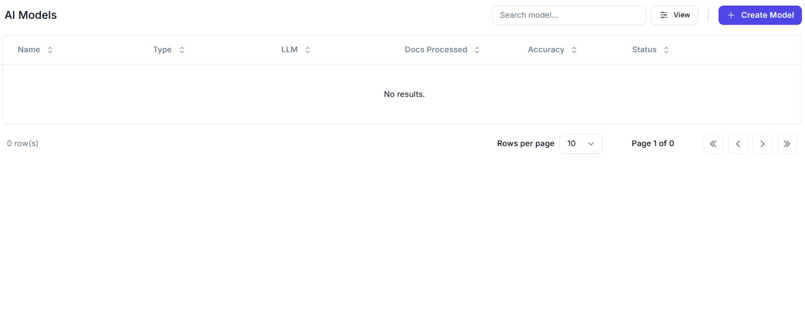
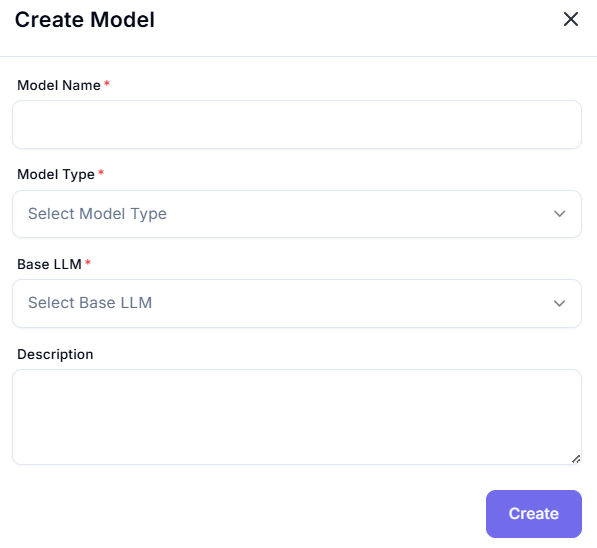

# AI Models Dashboard

The AI Models section allows users to build, fine-tune, and manage models for classification, extraction, summarization, and more—across documents, audio, and image formats.
- Users can create models by selecting the task type, base LLM, and uploading sample data for labeling and training.
- Models can be iteratively refined using human feedback to improve accuracy and performance over time.
- Once finalized, AI models can be attached to Agents for execution within production workflows.
- You can track different model versions and experiment with various LLMs to identify the most effective configuration.

## Main Features:
- **Search Model**: Search bar at the top to find specific models.
- **Create Model**: A button (`+ Create Model`) to add a new AI model.
- **Model Table**: Displays model attributes:
  - Name
  - Type
  - LLM (Large Language Model)
  - Docs Processed
  - Accuracy
  - Status
- **Pagination Controls**: Allows navigating between pages if there are multiple entries.
---
# Create Model

This form is used to create and register a new AI model in the Worc-space platform. These models can be used in automation flows or integrated into agents.

---

## Field Descriptions

| **Field**        | **Description** |
|------------------|-----------------|
| **Model Name**  | A unique name to identify the AI model. Helps in organizing and referencing the model in workflows. |
| **Model Type** | A dropdown to select the purpose or category of the model (e.g., classification, NLP, generative). |
| **Base LLM**  | Choose the foundational large language model (e.g., GPT, LLaMA, Claude) that your model will be built or fine-tuned on. |
| **Description**  | Provide a summary of what the model does, its training purpose, or how it should be used. |

---

## Create Button

- **Create**: Submits the form and registers the model in the platform.
- After creation, users may proceed to train, fine-tune, or deploy the model as needed.
- After creating the AI Model you will land to the AgentBuilder

---
