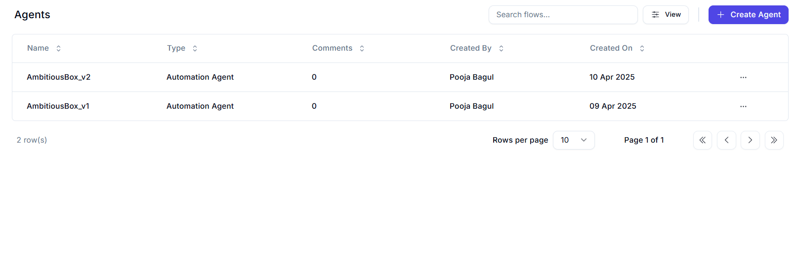
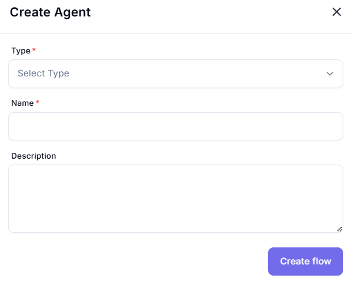

# Agents 

The Agents section enables users to create, view, and manage agents that encapsulate specific workflows or automation logic.
- An Agent acts as a modular container for AI-powered tasks or processes.
- You can maintain multiple versions of an agent (e.g., v1, v2) to track changes and support rollback when needed.
- Once an agent is published and moved to production, it transitions to the Orchestrator > Agents section for monitoring and execution management.

## Main Features:
- **Search Flows**: A search bar to look for specific agents.
- **Create Agent**: Button (`+ Create Agent`) for adding a new agent.
- **Agent Table**: Displays agent attributes:
  - Name
  - Type
  - Comments
  - Created By
  - Created On (date)

---
# Create Agent

This form allows users to define and register a new automation agent within the Worc-space platform.

---

## Field Descriptions

| **Field**       | **Description** |
|------------------|-----------------|
| **Type** | Dropdown list to choose the agent category (e.g., `Automation Agent`, `AI Agent`). This determines the agent’s functionality. |
| **Name** | Text field to input a unique identifier for the agent. This is how the agent will be listed in the workspace. |
| **Description** | Area to describe the agent’s purpose or workflow logic. Helps in collaboration and documentation. |

## Create Flow Button

- **Create flow**: After filling in the necessary fields, click this button to finalize the agent's creation.
- It typically redirects you to a flow editor where you can define tasks, conditions, and automation steps visually.
- After creating the agent you will land to the AgentBuilder

---
