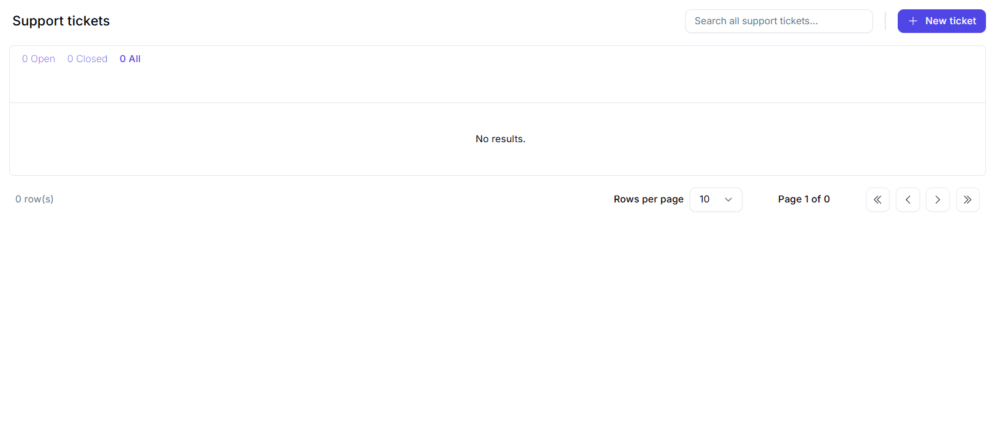
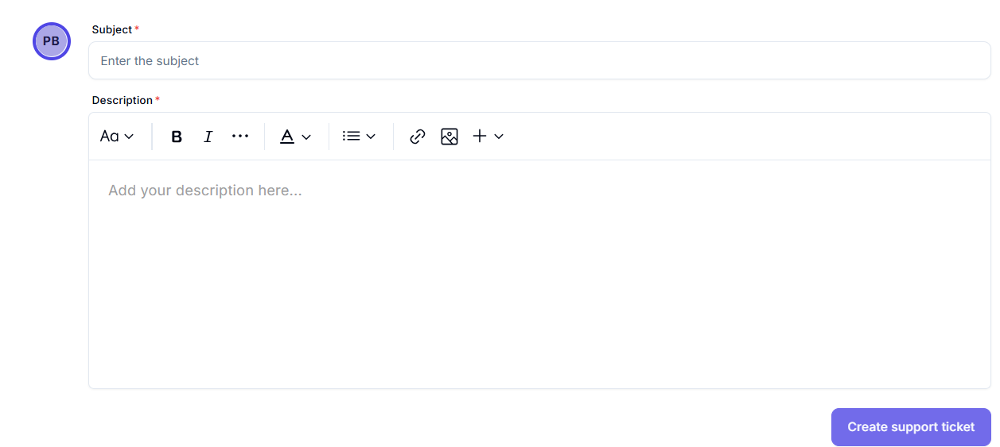

# Support Tickets Dashboard

This page manages and tracks user support tickets.

- Centralized space to access help resources, including documentation, user guides, and FAQs.
- Allows users to raise and track support tickets for faster issue resolution.
- Designed to help users troubleshoot problems and get the most out of Worc-space’s features.

## Main Features:

- **Ticket Status Filters**:
  - Open
  - Closed
  - All (default selected)
- **Search Bar**: Search across all support tickets.
- **New Ticket**: Button (`+ New ticket`) for creating a new support ticket.

---

# Create Support Ticket

This form allows users to report issues, ask questions, or request support from the Worc-space team. It's a central way to communicate with the support system to resolve platform-related problems.

---

## Field Descriptions

| **Field**       | **Description**                                                                                                                                                                     |
| --------------- | ----------------------------------------------------------------------------------------------------------------------------------------------------------------------------------- |
| **Subject**     | A short, clear summary of the issue or request. This helps the support team quickly understand the nature of the problem (e.g., "Agent not responding", "Issue with model upload"). |
| **Description** | A detailed explanation of the issue.                                                                                                                                                |

---

## Button

- **Create support ticket**: Submits the ticket to the support team.
- After submission, a tracking system typically follows up on the status and resolution progress.

---

## Best Practices

- Be specific and detailed in your description.
- Use bullet points or numbering for step-by-step issues.
- Attach images or relevant data when possible to help the support team replicate the issue quickly.
