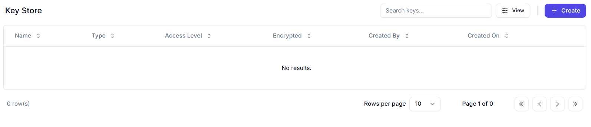
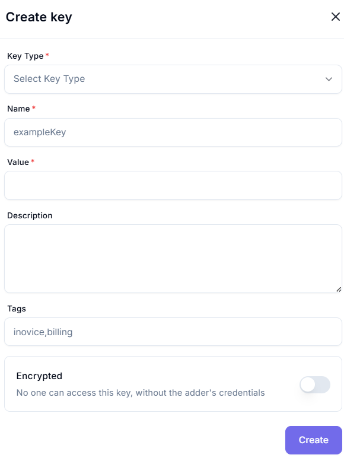

# Key Store 

The **Key Store** is a secure location where encryption or API keys can be managed. Below is a breakdown of the interface elements based on the provided screenshot.

---

## Table Columns

| Column Name  | Description |
|--------------|-------------|
| **Name**     | The name assigned to the key. |
| **Type**     | The type of key (e.g., API, Encryption). |
| **Access Level** | Specifies who can access the key (e.g., Admin, Read-only). |
| **Encrypted** | Indicates whether the key is stored in encrypted form. |
| **Created By** | The user who created the key. |
| **Created On** | The timestamp when the key was created. |

---

## Controls & Actions

- **Search Bar**: Filter keys by typing a name.
- **View/Filter Icon**: Customize visible keys or table columns.
- **+ Create Button**: Initiates the process to add a new key.
- **Pagination Controls**: Navigate through pages of key entries.

---

## ℹStatus

- **No results**: Indicates that there are currently no keys stored.
- **Page 1 of 0**: Confirms that the list is empty.

---

## Next Steps

To create a new key:
1. Click on the **+ Create** button.
2. Fill in the required key details (name, type, access level, etc.).
3. Confirm whether the key should be encrypted.
4. Save the key.
---

# Create Key

Use this form to securely create a new key for use in automation processes or secure storage.

---

## Key Configuration

| Field         | Type      | Required | Example         | Description                                                                 |
|--------------|-----------|----------|-----------------|-----------------------------------------------------------------------------|
| **Key Type** | Dropdown  | ✅       | `Select Key Type` | Type of key (e.g., text, credential).                                      |
| **Name**     | Text      | ✅       | `exampleKey`     | Unique identifier for the key.                                              |
| **Value**    | Text      | ✅       | `*****`          | Secret or sensitive data (masked).                                          |
| **Description** | Text Area | ❌    | `Monthly API key for billing` | Optional context or notes for the key.                                     |
| **Tags**     | Text (CSV)| ❌       | `invoice,billing` | Comma-separated keywords for search or grouping.                           |

---

## Encryption Option

- **Encrypted**: `Toggle Switch`  
  > _When enabled, only the creator can access the key using their credentials._

---

## Final Step

- Click **Create** (purple button) to save the key securely.

