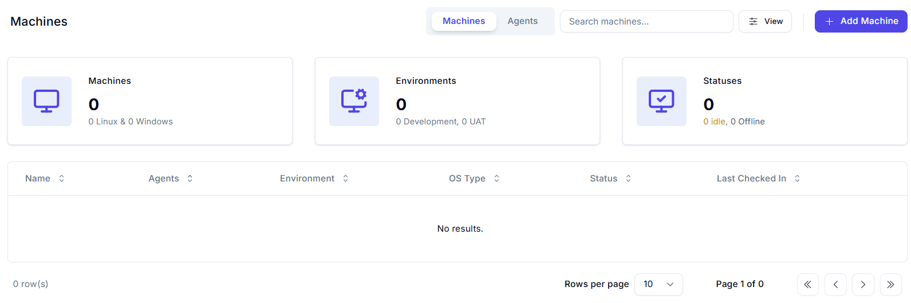
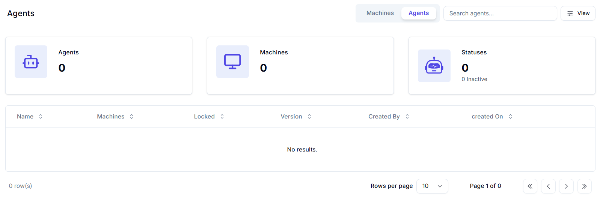
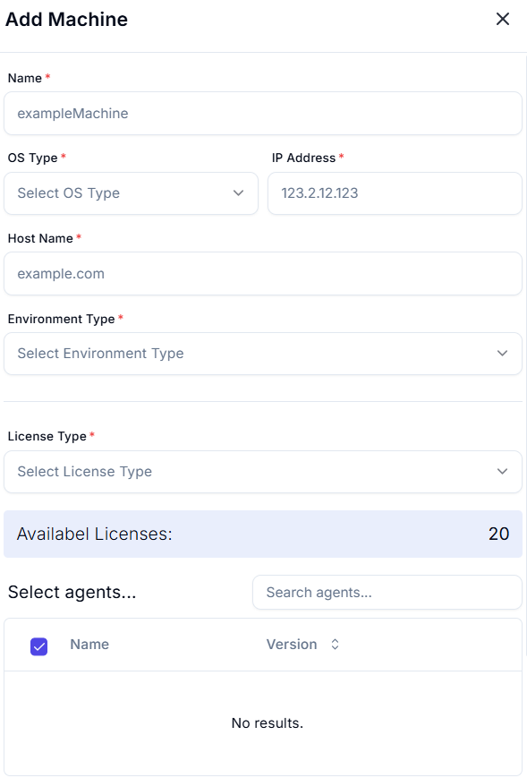

## Machines

Machines are Orchestrator entities that allow administrators to configure settings for unattended automation infrastructure.

In this context:

- A **machine** refers to the machine object defined in Orchestrator.
- A **host machine** represents the physical or virtual workstation where the UiPath® Robot is installed.

### Main Functions of a Machine Object

- **Authorize Robot-Orchestrator Connections**  
  Ensures secure communication between the UiPath Robot and Orchestrator. This is done using either:

  - A **machine key**, or
  - A **client ID–client secret pair**,  
    depending on the robot authentication method configured on the tenant.  
    _[Learn more about robot authentication.]_

- **Manage Execution Capacity**  
  Controls how many processes can run concurrently on the host machine.

- **Specialize Host Machines**  
  Designates specific host machines to run certain types of automation processes.

> **Note:** Machine objects are **global resources**, which means they are accessible across all folders in Orchestrator.

# Agents Dashboard

The **Agents** section provides a summary and management interface for all automation agents and their related infrastructure.

---

## Overview Cards

| Metric   | Value | Description                        |
| -------- | ----- | ---------------------------------- |
| Agents   | 0     | Total number of agents configured. |
| Machines | 0     | Machines associated with agents.   |
| Statuses | 0     | All agents are currently inactive. |

---

## Table Columns

| Column Name    | Description                                   |
| -------------- | --------------------------------------------- |
| **Name**       | The name of the agent.                        |
| **Machines**   | Machines linked to the agent.                 |
| **Locked**     | Indicates if the agent is locked for editing. |
| **Version**    | The version of the agent installed or used.   |
| **Created By** | User who created the agent configuration.     |
| **Created On** | Date and time when the agent was created.     |

---

## Controls

- **Search Bar**: Filter agents by name.
- **View Filter Icon**: Customize the table view.
- **Pagination**: Navigate through available pages of agents.
- **Tab Switcher**: Toggle between "Machines" and "Agents" views.

---

## Status

- **No results**: No agent configurations are currently present.

---

# Add Machine

Use this form to register a new machine in the automation environment.

## 

## Machine Configuration

| Field                | Type     | Required | Example                   | Notes                            |
| -------------------- | -------- | -------- | ------------------------- | -------------------------------- |
| **Name**             | Text     | ✅       | `exampleMachine`          | Unique machine identifier.       |
| **OS Type**          | Dropdown | ✅       | `Select OS Type`          | E.g., Windows, Linux.            |
| **IP Address**       | Text     | ✅       | `123.2.12.123`            | Machine's static IP address.     |
| **Host Name**        | Text     | ✅       | `example.com`             | FQDN or local host.              |
| **Environment Type** | Dropdown | ✅       | `Select Environment Type` | E.g., Dev, Test, Prod.           |
| **License Type**     | Dropdown | ✅       | `Select License Type`     | Depends on license availability. |

---

## Licensing Info

- **Available Licenses**: `0`

---

## Select Agents

| Selection | Name             | Version      |
| --------- | ---------------- | ------------ |
| ☑️        | _None Available_ | _No results_ |

_Search agents by name._

---
