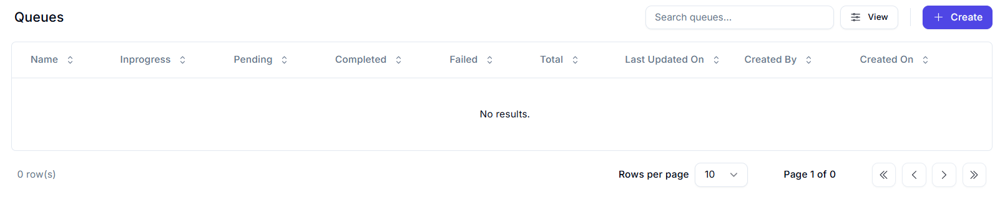

# Queues

## About Queues

A **queue** is a container that can hold an unlimited number of items. Each queue item can include various types of data, 
such as invoice information or customer details, which can be processed by external systems like SAP or Salesforce.
By default, the data in queue items is unstructured. However, for scenarios requiring a specific format—like integrations with 
external applications, processing machine-generated forms, or analytics—you can upload **custom JSON schemas** to enforce structure.

### Key Features:
- Queues are empty by default.
- You can add items via:
  - Orchestrator (manual upload).
  - Studio (via specific activities).
- Once queue items are processed, they are considered **transactions**.

# Queues Dashboard - Worc-space

The Queues section provides a centralized view of work items awaiting processing by automation agents. It helps you monitor throughput, backlog, and error rates at a glance.

---

## Queues Table

| Column            | Description |
|-------------------|-------------|
| **Name**          | Unique identifier for the queue |
| **In Progress**   | Number of work items currently being processed |
| **Pending**       | Items waiting in the queue |
| **Completed**     | Successfully processed items count |
| **Failed**        | Items that encountered errors during processing |
| **Total**         | Sum of all items ever enqueued (In Progress + Pending + Completed + Failed) |
| **Last Updated On** | Timestamp of the most recent queue activity |
| **Created By**    | User who created the queue |
| **Created On**    | Date when the queue was created |

> **Note:** In the screenshot, no queues are defined yet (0 results).

---

## Create Queue

Use the **Create** button to define a new queue. You can then assign work items and configure retry/failure policies for your automation workflows.

---

### Typical Workflow

1. **Enqueue** jobs via desktop flow or API  
2. **Monitor** queue metrics (Pending / In Progress)  
3. **Inspect** failures and retry as needed  
4. **Scale** your agents to handle growing load  

## Queues Overview

Queues enable you to build robust automation solutions with complex logic. For example:
- One process collects invoice data and creates a queue item for each.
- Another process retrieves these items from Orchestrator and performs tasks like paying invoices, delaying payment based on due dates, or notifying the accounting team.

### Queues Page Highlights:
- Create and view queues.
- Access transaction charts (e.g., average execution time, success rates).
- Real-time updates may have minor delays.
- Data is **not** affected by retention policies.
- Item statuses are controlled by RPA developers.
- Revision statuses (for abandoned or failed items) are controlled within Orchestrator.

### Revision and Review:
- Failed/abandoned items can be assigned to reviewers.
- Reviewer assignments and status changes are tracked in the **History** tab.
- Review actions are performed from the **Review Requests** page.

> ⚠️ **Important:**  
> For successful processing using references, ensure that each reference is **unique** at the queue level.  
> Non-unique references may cause concurrency issues such as the "No Transaction Data" error.  
> If uniqueness cannot be ensured, **dequeue items without using references**.

---

## Schema Definitions

You can upload a **custom JSON schema** when creating/editing a queue for the following:
- Specific Data
- Output Data
- Analytics Data

### Schema Guidelines:
- Transactions are validated against the schema post-upload.
- Invalid data fails with a **Business Exception**.
- Schema is **not applied retroactively**.
- Schemas **must not contain arrays**.
- `DateTime` values must be passed as strings.
- **Analytics Data** requires agents and Activities version **19.10+**.
- If no valid schema URI is found, **draft-07** is used as fallback.

### Data Size Limit:
- The `Specific Data` field is limited to **1 MB** (`Queue.MaxSpecificDataSizeInKiloBytes`).
- Larger payloads must be stored externally, and a reference should be saved in the item instead.

---

# Create Queue

## General Details

- **Name** (Required):  
  A unique name that identifies the queue. It helps users and systems refer to this queue clearly. Most platforms, like UiPath Orchestrator, limit this to around 50 characters. Choose a meaningful name to easily distinguish the queue.

- **Description** (Optional):  
  A brief explanation of the queue’s purpose or contents (e.g., “Queue of customer support requests”). While not mandatory, it helps team members quickly understand the queue's role. Typically limited to 250 characters.

---

## Additional Details

- **Enforce Unique References** (Optional):  
  Ensures each queue item has a unique transaction reference. This is important for 
  idempotency and avoiding duplicate processing. If unchecked, multiple items can share the same reference.

- **Store in Encrypted Format** (Optional):  
  Encrypts the “Specific Data” and “Output Data” fields at rest in the database. 
  Only the UI/application can decrypt them during display. This enhances security but cannot be undone. Applies only to new items; existing items are unaffected.

---

## Auto Retry

- **Failed Items** (Optional):  
- Automatically retries items that fail during processing. Useful for transient errors (e.g., network issues). If unchecked, failed items require manual handling.
- This optional checkbox enables automatic retry for items that fail during processing. If enabled, any item that ends up in a “Failed” status will be re-queued and retried up to the retry limit
docs-prod-tm.trafficmanager.net
- This is useful for recovering from transient errors (e.g. a temporary network glitch) without manual intervention. If this box is unchecked, failed items will remain failed until a user intervenes. In UiPath’s newer documentation, this is explicitly called out: “Failed items – retries any queue items that fail after creating the queue.”
docs-prod-tm.trafficmanager.net

- **Abandoned Items** (Optional):  
-  Retries items that were started but never completed (e.g., due to robot crashes). If unchecked, such items are typically marked as error after a timeout and are not retried.

- **Max Of Retries** (Required):  
  Sets the number of retry attempts for failed or abandoned items. Helps prevent infinite loops. For example, setting this to `3` allows two retries after the initial attempt. Most platforms recommend a range of 1–50 retries.

---

## Schema Definitions

- **Specific Data JSON Schema** (Required):  
  Upload a JSON schema file that defines the structure of each queue item’s “specific data.” The system uses this to validate incoming data. If the item doesn't match the schema, it’s rejected. This ensures consistent, reliable data for processing. Validation only applies to new items.

