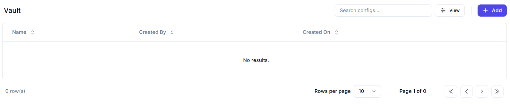
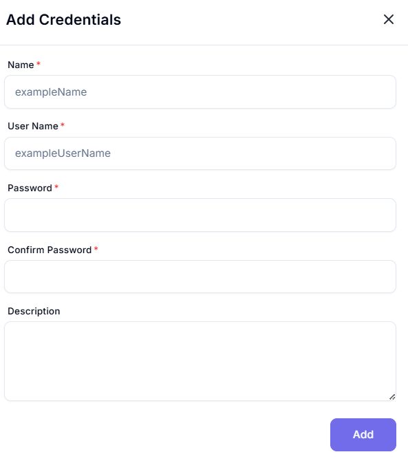

# Vault

The **Vault** is a secure section used for managing configuration secrets, credentials, or other sensitive items in a structured and auditable manner.

---

## Table Columns

| Column Name   | Description                                      |
|---------------|--------------------------------------------------|
| **Name**      | The name of the vault entry or configuration.    |
| **Created By**| The user who created the vault entry.            |
| **Created On**| The date and time the entry was created.         |

---

## Controls & Actions

- **Search Bar**: Filter the list by typing keywords related to configurations.
- **View/Filter Icon**: Adjust visible settings or filters for a better overview.
- **+ Add Button**: Use this to create a new vault entry.
- **Pagination Controls**: Navigate between pages of stored vault items.

---

## Status

- **No results**: No entries have been created in the vault yet.
- **Page 1 of 0**: Confirms that there are currently no records.

---

## How to Add a Vault Entry

1. Click the **+ Add** button.
2. Enter a **Name**, **Value**, and assign metadata as needed.
3. Confirm and save your configuration securely.
---

# Add Credentials

Use this form to securely store user credentials for use in automated workflows or secure credential vaults.

---

## 🧾 Credential Details

| Field              | Type       | Required | Example            | Description                                                |
|-------------------|------------|----------|--------------------|------------------------------------------------------------|
| **Name**          | Text       | ✅       | `exampleName`       | A unique display name for the credentials entry.           |
| **User Name**     | Text       | ✅       | `exampleUserName`   | The username associated with the credentials.              |
| **Password**      | Password   | ✅       | `*****`             | The password (masked input).                              |
| **Confirm Password** | Password| ✅       | `*****`             | Repeat password to confirm match.                          |
| **Description**   | Text Area  | ❌       | `Admin login for QA DB` | Optional notes or context for the credentials.       |

---

## Final Step

- Click **Add** (purple button) to securely store the credentials.

