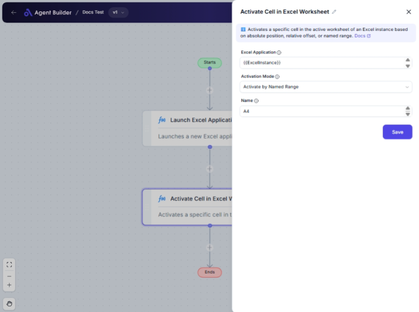

import { Callout, Steps } from "nextra/components";

# Activate Cell in Excel Worksheet

The **Activate Cell in Excel Worksheet** node allows you to select a specific cell within an Excel worksheet to perform further operations. This can be done in various ways, such as by specifying exact cell coordinates, using an offset from the current cell, or using a predefined named range. This is ideal for scenarios where you want to manipulate or interact with specific parts of your Excel data dynamically.

{/*  */}

## Configuration Options

| Field Name                  | Description                                                                      | Input Type | Required? | Default Value |
| --------------------------- | -------------------------------------------------------------------------------- | ---------- | --------- | ------------- |
| **Excel Application**       | The Excel Application object containing the target worksheet.                    | Text       | Yes       | _(empty)_     |
| **Activation Mode**         | Choose how to activate the cell: absolutely, relatively, or via named range.     | Select     | Yes       | Absolute      |
| **Column**                  | The column letter (e.g., 'A', 'B') or number (e.g., 1, 2) of the target cell.    | Text       | No        | _(empty)_     |
| **Row**                     | The row number of the target cell.                                               | Text       | No        | _(empty)_     |
| **Name**                    | The name of the named range or cell to activate.                                 | Text       | No        | _(empty)_     |
| **Direction**               | The direction to move from the currently active cell when activating relatively. | Select     | No        | Down          |
| **Offset From Active Cell** | Number of cells to move from the current active cell when activating relatively. | Text       | No        | _(empty)_     |

## Expected Output Format

This node does not produce an output in the traditional sense but rather changes the focus within an Excel worksheet to the specified cell.

## Step-by-Step Guide

<Steps>
### Step 1

Add the **Activate Cell in Excel Worksheet** node to your flow.

### Step 2

In the **Excel Application** field, specify the Excel Application object that contains the workbook and worksheet you are working with.

### Step 3

Choose the **Activation Mode** from the dropdown:

- **Activate by Name (Absolute)**: Uses the exact row and column coordinates.
- **Activate by Offset (Relative)**: Moves a specified number of rows or columns from the currently active cell.
- **Activate by Named Range**: Uses a predefined name to locate the cell or range.

### Step 4

Depending on the selected **Activation Mode**, configure additional fields:

- For **Absolute**, specify the **Column** and **Row** of the target cell.
- For **Relative**, select the **Direction** and specify the **Offset From Active Cell**.
- For **Named Range**, provide the **Name** of the cell or range.

### Step 5

Once configured, this node will focus the specified cell within the Excel worksheet, readying it for further operations.

</Steps>

<Callout type="info" title="Note">
  Fields like "Column" and "Row" are only visible when "Activate by Name" is
  selected. Fields like "Direction" and "Offset From Active Cell" are visible
  when "Activate by Offset" is chosen.
</Callout>

## Input/Output Examples

| Activation Mode         | Column  | Row     | Name       | Direction | Offset From Active Cell | Description                                              |
| ----------------------- | ------- | ------- | ---------- | --------- | ----------------------- | -------------------------------------------------------- |
| Activate by Name        | B       | 5       | _(n/a)_    | _(n/a)_   | _(n/a)_                 | Activates the cell at column B, row 5.                   |
| Activate by Offset      | _(n/a)_ | _(n/a)_ | _(n/a)_    | Right     | 3                       | Moves 3 cells to the right from the current active cell. |
| Activate by Named Range | _(n/a)_ | _(n/a)_ | SalesRange | _(n/a)_   | _(n/a)_                 | Activates the cell or range named "SalesRange".          |

## Common Mistakes & Troubleshooting

| Problem                                         | Solution                                                                                                                      |
| ----------------------------------------------- | ----------------------------------------------------------------------------------------------------------------------------- |
| **Column and Row fields not showing up**        | Ensure you selected **"Activate by Name"** in Activation Mode. These fields become available only when this option is picked. |
| **Named Range doesn't exist**                   | Check that the named range actually exists in your Excel worksheet. You might need to create or define it first.              |
| **Unexpected results with relative activation** | Double-check the **Direction** and **Offset From Active Cell** to ensure they are set to the desired movement.                |

## Real-World Use Cases

- **Automate Data Entry**: Focus on a specific cell to input or copy data automatically.
- **Data Analysis**: Direct actions, like calculations or formatting, to specific areas of your spreadsheet.
- **Navigation in Large Worksheets**: Quickly jump to different sections of complex Excel files for review or editing.
