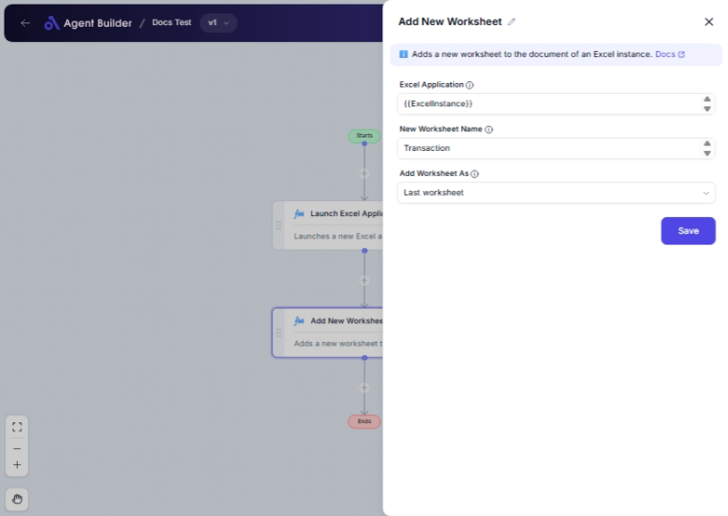

import { Callout, Steps } from "nextra/components";

# Add New Worksheet

The **Add New Worksheet** node allows you to introduce a new worksheet within an existing Excel workbook. This is particularly useful for organizing data by adding structured sheets within your workbooks without having to manually do it through Excel. You can choose to place the new worksheet either at the beginning or the end of the workbook and optionally specify its name.

{/*  */}

## Configuration Options

| Field Name             | Description                                                                                    | Input Type | Required? | Default Value |
| ---------------------- | ---------------------------------------------------------------------------------------------- | ---------- | --------- | ------------- |
| **Excel Application**  | The Excel Application object containing the workbook where you want to add a new worksheet.    | Text       | Yes       | _(empty)_     |
| **New Worksheet Name** | The name you want to assign to the new worksheet. If left empty, Excel assigns a default name. | Text       | No        | _(empty)_     |
| **Add Worksheet As**   | Specifies where to add the new worksheet: as the first or last sheet in the workbook.          | Select     | Yes       | First         |

## Expected Output Format

Upon execution, this node modifies the given Excel Application object by adding a worksheet according to your specifications. There is no "output value" in terms of data types, but the worksheet is added, modifying the state of the Excel Application.

## Step-by-Step Guide

<Steps>
### Step 1

Add the **Add New Worksheet** node into your flow.

### Step 2

In the **Excel Application** field, enter the reference to your Excel Application object that contains the workbook to which you want to add the new worksheet.

### Step 3

Optionally enter a name for the new worksheet in the **New Worksheet Name** field. If left empty, a default name like "Sheet1", "Sheet2", etc., will be used.

### Step 4

Select where you would like to add the new worksheet using the **Add Worksheet As** dropdown:

- **First worksheet**: Adds the new sheet at the beginning of the workbook.
- **Last worksheet**: Adds the new sheet at the end of the workbook.

### Step 5

Execute the flow, and the new worksheet will be added to the specified position within the workbook.

</Steps>

<Callout type="info" title="Tip">
  Specifying a meaningful name for your new worksheet in the **New Worksheet
  Name** field can make managing your workbook easier, especially when working
  with multiple sheets.
</Callout>

## Input/Output Examples

| Excel Application | New Worksheet Name | Add Worksheet As | Result                                                                                |
| ----------------- | ------------------ | ---------------- | ------------------------------------------------------------------------------------- |
| Workbook1         | Analysis Sheet     | First worksheet  | Adds "Analysis Sheet" as the first sheet in Workbook1.                                |
| Workbook2         | Summary            | Last worksheet   | Adds "Summary" as the last sheet in Workbook2.                                        |
| Workbook3         | _(empty)_          | First worksheet  | Adds a new worksheet named "Sheet1", "Sheet2", etc., as the first sheet in Workbook3. |

## Common Mistakes & Troubleshooting

| Problem                              | Solution                                                                                           |
| ------------------------------------ | -------------------------------------------------------------------------------------------------- |
| **Excel Application field is empty** | Ensure that you provide a valid Excel Application object in the **Excel Application** field.       |
| **New worksheet not appearing**      | Double-check that you executed the flow after configuring the node.                                |
| **Worksheet name already exists**    | Make sure the **New Worksheet Name** does not duplicate an existing sheet name to avoid conflicts. |

## Real-World Use Cases

- **Monthly Reports**: Insert new sheets monthly to track or input new data without affecting existing records.
- **Budget Planning**: Add planned or actual sheets at the start or end of the workbook for periodic updates.
- **Data Segmentation**: Organize data by creating new sheets at specific positions for better data handling and insights.
