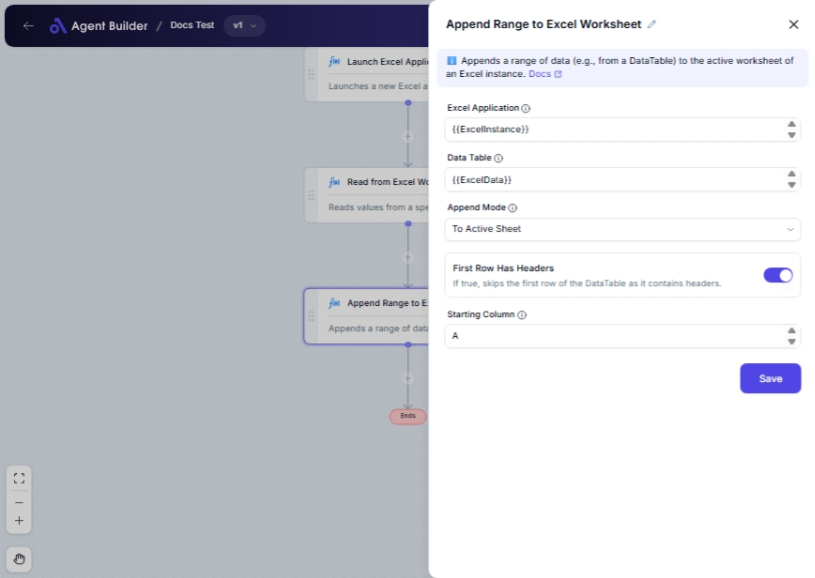

import { Callout, Steps } from "nextra/components";

# Append Range to Excel Worksheet

The **Append Range to Excel Worksheet** node enables you to effortlessly add data from a DataTable into an Excel worksheet. It is especially useful when you have data that needs to be continuously updated or appended to an existing Excel file, streamlining your data integration and management tasks.

Common uses for this node include:

- Adding new data records to a spreadsheet without overwriting existing information.
- Updating Excel reports with the latest data entries.
- Integrating data entries from multiple DataTables into a single organized Excel worksheet.

{/*  */}

## Configuration Options

| Field Name                | Description                                                               | Input Type | Required? | Default Value |
| ------------------------- | ------------------------------------------------------------------------- | ---------- | --------- | ------------- |
| **Excel Application**     | The Excel Application object containing the target worksheet.             | Text       | Yes       | _(empty)_     |
| **Data Table**            | The DataTable containing the data to be appended to the worksheet.        | Text       | Yes       | _(empty)_     |
| **Append Mode**           | Specifies how to append data: To Named Cells or To Active Sheet.          | Select     | No        | ToActiveSheet |
| **Name**                  | The name of the named range to which data should be appended.             | Text       | No        | _(empty)_     |
| **First Row Has Headers** | If true, skips the first row of the DataTable as it contains headers.     | Switch     | No        | _(empty)_     |
| **Starting Column**       | The starting column letter where appending should begin (e.g., 'A', 'B'). | Text       | No        | _(empty)_     |

## Expected Output Format

The result of this operation is an updated Excel worksheet with the new data appended as specified. The output is not tangible data, but an action performed on a worksheet file within the Excel application.

## Step-by-Step Guide

<Steps>
### Step 1

Add the **Append Range to Excel Worksheet** node into your flow.

### Step 2

In the **Excel Application** field, input or select your Excel file containing the target worksheet.

### Step 3

In the **Data Table** field, specify the DataTable that holds the data you want to append.

### Step 4

Select an **Append Mode** from the dropdown list. Choose **To Active Sheet** to append to the current worksheet or **To Named Cells** to specify a named range.

### Step 5

If you selected **To Named Cells**, enter the name of the range in the **Name** field.

### Step 6

Specify whether the **First Row Has Headers** using the switch. Enable it if your data table's first row contains headers.

### Step 7

For **To Active Sheet**, designate the **Starting Column** for where data should begin appending.

### Step 8

Execute the flow to append data to the Excel worksheet as configured.

</Steps>

<Callout type="info" title="Tip">
  Selecting **To Active Sheet** in the **Append Mode** dropdown allows you to
  specify a starting column, which helps control where your data is appended in
  the worksheet.
</Callout>

## Input/Output Examples

Input Data Example:

- **Data Table**: A table containing rows of employee records
- **Append Mode**: `ToNamedCells`
- **Name**: `EmployeeData`
- **First Row Has Headers**: `true`

Expected Outcome:

- The employee data are appended into the specified named range 'EmployeeData' in the Excel worksheet, starting from the designated spot.

## Common Mistakes & Troubleshooting

| Problem                          | Solution                                                                                                   |
| -------------------------------- | ---------------------------------------------------------------------------------------------------------- |
| **Failure to append data**       | Ensure that both **Excel Application** and **Data Table** fields are correctly specified.                  |
| **Named range not found**        | Verify the **Name** field matches an existing named range in your Excel worksheet when using named ranges. |
| **Data appends in wrong column** | Check that the **Starting Column** is correctly specified for the desired append location.                 |
| **Headers incorrectly appended** | Enable **First Row Has Headers** if your DataTable includes headers.                                       |

## Real-World Use Cases

- **Monthly Sales Updates**: Continuously append monthly sales data to a yearly sales report without disrupting previous data.
- **Employee Directory Management**: Append new employee records to a master employee directory in Excel as they join the company.
- **Inventory Tracking**: Add inventory updates to an existing inventory list for real-time management.
