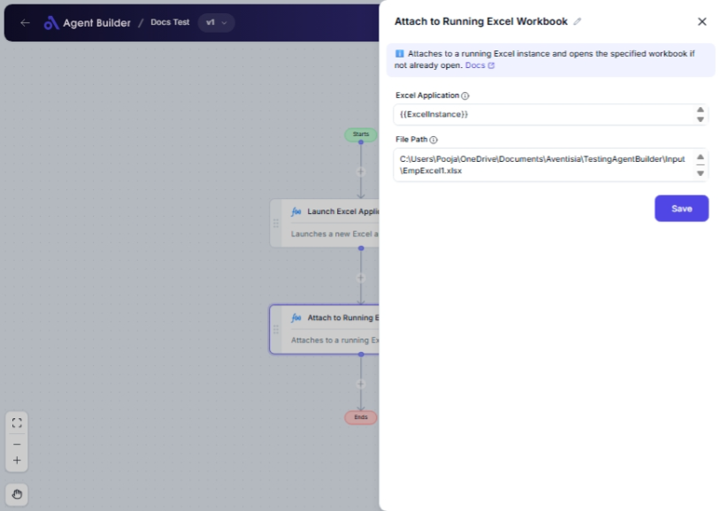

import { Callout, Steps } from "nextra/components";

# Attach to Running Excel Workbook

The **Attach to Running Excel Workbook** node is designed to link your automation flow to an already open Excel application. This is beneficial when you want to perform operations on an Excel workbook that's currently active without opening a new instance. It helps streamline workflows by ensuring that changes or data access are carried out within the existing workbook context.

For example:

- Interact with a workbook that is actively being edited.
- Use real-time data from ongoing Excel sessions in your automation.

## Configuration Options

| Field Name            | Description                                                                          | Input Type | Required? | Default Value |
| --------------------- | ------------------------------------------------------------------------------------ | ---------- | --------- | ------------- |
| **Excel Application** | The running Excel Application object you wish to connect to.                         | Text       | Yes       | _(empty)_     |
| **File Path**         | The complete path of the Excel file to either open or attach to within that session. | Text       | Yes       | _(empty)_     |

## Expected Output Format

This node does not produce a direct data output. Instead, it seamlessly connects your automation to an active Excel session for further operations within the flow.

## Step-by-Step Guide

<Steps>
### Step 1

Add **Attach to Running Excel Workbook** node into your flow.

### Step 2

In the **Excel Application** field, provide the application object for the currently running Excel session you want to attach to. This is necessary to ensure correct connectivity.

### Step 3

For the **File Path** field, enter the complete path of the Excel file you wish to connect to or open in the active Excel application.

### Step 4

Ensure that the node successfully matches the entered details with the active Excel session for further actions.

</Steps>

<Callout type="info" title="Tip">
  To find your Excel file's full path, right-click on the file, select
  "Properties," and copy the path from the "Location" field, then add the file
  name and extension.
</Callout>

## Input/Output Examples

| Excel Application        | File Path                              | Notes                                                  |
| ------------------------ | -------------------------------------- | ------------------------------------------------------ |
| `Current Excel Instance` | `C:\Users\JohnDoe\Documents\data.xlsx` | Links to the ongoing session of Excel for "data.xlsx". |

## Common Mistakes & Troubleshooting

| Problem                                    | Solution                                                                                  |
| ------------------------------------------ | ----------------------------------------------------------------------------------------- |
| **Incorrect or missing Excel Application** | Ensure the application object is referenced correctly (this is specific to each session). |
| **File not found**                         | Verify the file path is correct, exists, and includes the filename and extension.         |
| **Unexpected Excel session attached**      | Double-check that the Excel Application field targets the intended running session.       |

## Real-World Use Cases

- **Financial Analysis**: Directly working on an active budget sheet in Excel from another system without duplicating files.
- **Data Consolidation**: Automatically update data in a workbook that's currently in use by a team during a collaborative session.
- **Report Generation**: Pull live data from an active Excel workbook to generate and export reports.
