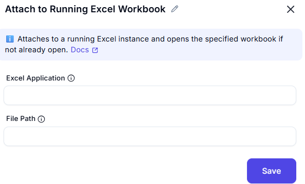

# Attach to Running Excel  

## Description
This feature allows users to attach to an already running instance of Microsoft Excel.  
It is useful for interacting with open workbooks without launching a new Excel instance.  

  

## Fields and Options  

### 1. Excel Application
- The running Excel Application object to attach to.

### 2. FilePath
- The full path of the Excel file to open or attach to in the running Excel instance.

## Use Cases
- Automating tasks in an already open Excel file.  
- Avoiding multiple Excel instances by reusing an existing one.  
- Attaching automation to a user-controlled Excel session.  

## Summary
The **Attach to Running Excel** action provides a way to interact with open Excel workbooks efficiently.  
It helps in integrating automation with ongoing Excel tasks while ensuring a seamless workflow.  