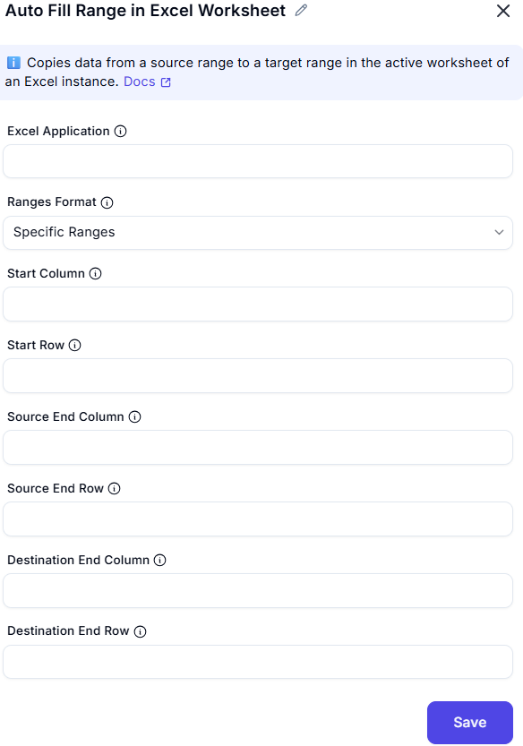

# Auto Fill Cells in Excel Worksheet  

## Description
This feature allows users to automatically fill cells in an Excel worksheet by copying data from a source range to a destination range.  

  

## Fields and Options  

### 1. Excel Instance
- A dropdown to select the active Excel instance.  
- Ensures the correct workbook is used for the operation.  

### 2. Ranges Format
- Defines how the ranges are specified. Options may include:  
  - **Named cells** (default)  
  - **Cell references**  
  - **Column/Row indices**  

### 3. Start Column
- The starting column index if specifying a range using indices.  

### 4. Start Row
- The starting row index if specifying a range using indices.  

### 5. Source End Column
- Specifies the named range or reference for the source cells to be copied.  

### 6. Destination End Row
- Specifies the named range or reference for the destination where the data should be copied.  

### 7. Destination End Column
- The ending column of the target range (e.g., 'C').

### 8. Destination End Row
-  The ending row of the target range (e.g., '10').

###
## Use Cases
- Automatically filling a report template with predefined data.  
- Copying data from one range to another dynamically.  
- Populating a dataset with calculated or referenced values.  
- Reducing manual effort in data entry and formatting.  

## Summary
The **Auto Fill Cells in Excel Worksheet** feature allows seamless copying of data between cell ranges in an Excel sheet, optimizing automation workflows.