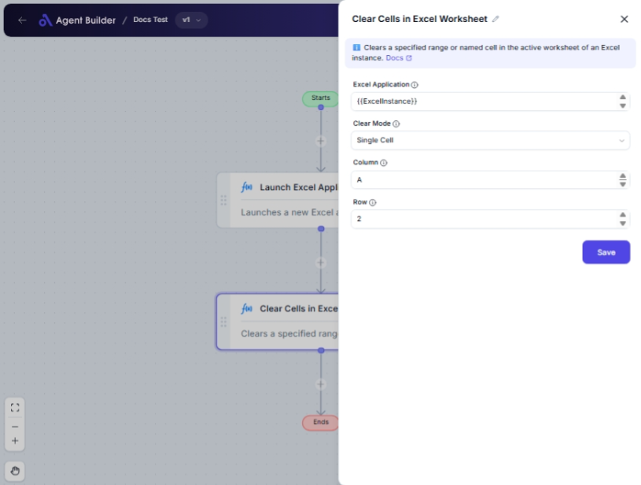

import { Callout, Steps } from "nextra/components";

# Clear Cells in Excel Worksheet

The **Clear Cells in Excel Worksheet** node is designed to automate the process of clearing content from specified cells in an Excel worksheet. This node provides flexibility in choosing individual cells, named ranges, or a series of cells based on location or relation to the active cell. It's particularly useful for cleaning up large datasets or preparing worksheets for new data input.

{/*  */}

## Configuration Options

| Field Name            | Description                                                                                                 | Input Type | Required? | Default Value |
| --------------------- | ----------------------------------------------------------------------------------------------------------- | ---------- | --------- | ------------- |
| **Excel Application** | The Excel Application object containing the target worksheet.                                               | Text       | Yes       | _(empty)_     |
| **Clear Mode**        | Specifies how to clear cells: Single Cell, Named Cells, Range of Cells, or Relative to Active Cell.         | Select     | Yes       | SingleCell    |
| **Column**            | Column letter or number of the target cell (e.g., 'A', 'B', or 1, 2). Only for **Single Cell** mode.        | Text       | No        | _(empty)_     |
| **Row**               | Row number of the target cell. Only for **Single Cell** mode.                                               | Text       | No        | _(empty)_     |
| **Name**              | Name of the named range or cell to clear. Only for **Named Cells** mode.                                    | Text       | No        | _(empty)_     |
| **Start Column**      | Starting column of the range to clear. Only for **Range of Cells** mode.                                    | Text       | No        | _(empty)_     |
| **End Column**        | Ending column of the range to clear. Only for **Range of Cells** mode.                                      | Text       | No        | _(empty)_     |
| **Start Row**         | Starting row of the range to clear. Only for **Range of Cells** mode.                                       | Text       | No        | _(empty)_     |
| **End Row**           | Ending row of the range to clear. Only for **Range of Cells** mode.                                         | Text       | No        | _(empty)_     |
| **X-Axis Direction**  | Direction to move from the active cell (Left or Right). Only for **Range Relative to Active Cell** mode.    | Select     | No        | Left          |
| **Y-Axis Direction**  | Direction to move (Above or Below) from the active cell. Only for **Range Relative to Active Cell** mode.   | Select     | No        | Above         |
| **X Offset**          | Number of cells to move horizontally from the active cell. Only for **Range Relative to Active Cell** mode. | Text       | No        | _(empty)_     |
| **Y Offset**          | Number of cells to move vertically from the active cell. Only for **Range Relative to Active Cell** mode.   | Text       | No        | _(empty)_     |

## Expected Output Format

This node doesn't provide an output value directly but performs an action by clearing specified cells in the provided Excel worksheet.

## Step-by-Step Guide

<Steps>
### Step 1

Add **Clear Cells in Excel Worksheet** node into your flow.

### Step 2

In the **Excel Application** field, input the Excel Application object that holds your target worksheet.

### Step 3

Choose a **Clear Mode** from the dropdown to define how you want to clear the cells:

- **Single Cell**: Clears a particular cell defined by column and row.
- **Named Cells**: Clears cells based on a named range.
- **Range of Cells**: Clears cells between defined start and end columns and rows.
- **Range Relative to Active Cell**: Clears cells in relation to the currently active cell based on specified offsets.

### Step 4

Depending on the chosen **Clear Mode**, enter the required cell or range details in the relevant fields. For instance, if you select **Single Cell**, fill in the **Column** and **Row** fields.

### Step 5

The cells specified will be cleared in the Excel worksheet as per the configuration.

</Steps>

<Callout type="info" title="Note">
  Ensure that the Excel worksheet containing the cells you wish to clear is open
  and accessible by the Excel Application object.
</Callout>

## Common Mistakes & Troubleshooting

| Problem                     | Solution                                                                             |
| --------------------------- | ------------------------------------------------------------------------------------ |
| **No cells cleared**        | Double-check that the Excel Application is correctly referencing the open worksheet. |
| **Incorrect cells cleared** | Verify the column, row, and range specifications for accuracy.                       |
| **Named range not found**   | Ensure the named range exists in your Excel worksheet.                               |

## Real-World Use Cases

- **Data Preparation**: Clear old data in preparation for new input in specific cells, ranges, or named ranges.
- **Report Formatting**: Clean sections of reports or dashboards in Excel before updating values.
- **Template Reuse**: Reset specific parts of a worksheet to zero or empty status for re-use as a template.
