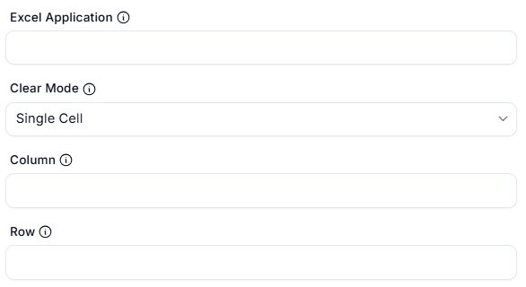

# Clear Cells in Excel Worksheet  

## Description  

This feature allows users to clear the contents of a specific range of cells in an Excel worksheet. It is useful for resetting or cleaning up data in a spreadsheet during automation workflows.  

  

## Fields and Options  

### 1. Excel Application
- Select the Excel instance (workbook) where the cells will be cleared.  
- This ensures the action is performed on the correct workbook.  

### 2. Clear Mode
- Choose what to clear in the specified range:  
  - **Contents**: Clear only the data in the cells.  
  - **Formats**: Clear only the formatting of the cells.  
  - **All**: Clear both contents and formatting.  

### 3. Column
- Enter the column of the range (e.g., `A`, `B`, `1`, `2`).  

### 4. Row
- Enter the row of the range (e.g., `1`, `2`, `10`).  

## Use Cases  
- Resetting a range of cells before populating them with new data.  
- Cleaning up old or unnecessary data in a worksheet.  
- Removing formatting from cells to standardize the appearance of a spreadsheet.  

## Summary  
The **Clear Cells in Excel Worksheet** action provides a way to clear the contents or formatting of a specific range of cells in an Excel worksheet. It ensures precise control over data cleanup and preparation for further automation tasks.  