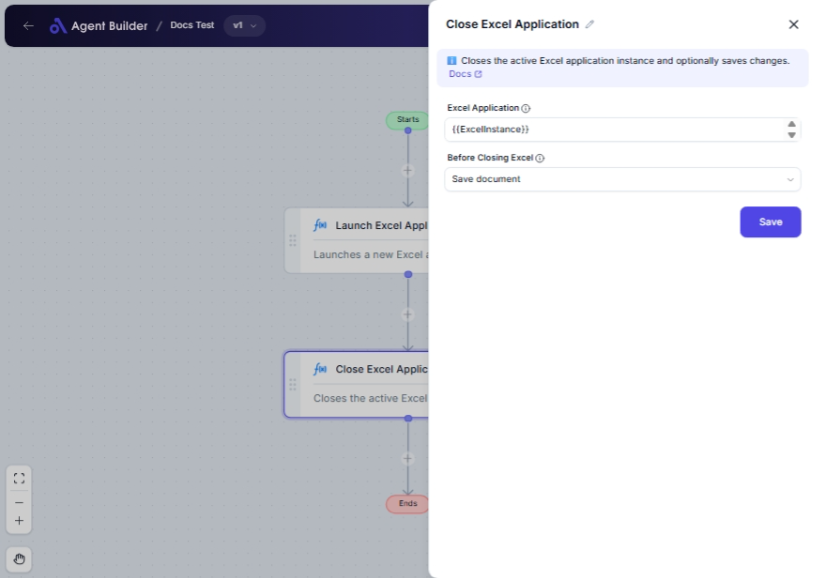

import { Callout, Steps } from "nextra/components";

# Close Excel Application

The **Close Excel Application** node allows you to automate the process of closing an Excel application from your desktop. This node is particularly useful for ensuring that the Excel application is properly closed after you have completed your spreadsheet tasks, which helps in freeing up system resources and preventing accidental data loss.

Closing Excel properly can also ensure that any changes you made are saved according to the preferences you set, maintaining data integrity.

{/*  */}

## Configuration Options

| Field Name               | Description                                                             | Input Type | Required? | Default Value |
| ------------------------ | ----------------------------------------------------------------------- | ---------- | --------- | ------------- |
| **Excel Application**    | The Excel Application object to close.                                  | Text       | Yes       | _(empty)_     |
| **Before Closing Excel** | Specifies what to do before closing Excel (such as saving changes).     | Select     | No        | SaveDocument  |
| **Save Path**            | The file path to save the document when 'Save Document As' is selected. | Text       | No        | _(empty)_     |

## Expected Output Format

The **Close Excel Application** node does not produce a direct data output that is visible in your flow. Instead, it performs the action of closing the Excel application as specified.

## Step-by-Step Guide

<Steps>
### Step 1

Add the **Close Excel Application** node into your flow.

### Step 2

In the **Excel Application** field, enter the specific Excel application object you wish to close. This is often a reference to an open Excel session.

### Step 3

Use the **Before Closing Excel** dropdown to determine your save preferences:

- **Do not save document**: Choose this if you want to close Excel without saving any changes.
- **Save document**: Select this to save any changes before closing.
- **Save document as**: Use this option to save the current document to a new path before closing.

### Step 4

If you choose **Save document as**, fill in the **Save Path** field with the desired file path for saving your document.

</Steps>

<Callout type="info" title="Tip">
  If you select "Save document as" in the **Before Closing Excel** dropdown,
  remember to specify a valid file path in the **Save Path** field.
</Callout>

## Common Mistakes & Troubleshooting

| Problem                              | Solution                                                                                                                                       |
| ------------------------------------ | ---------------------------------------------------------------------------------------------------------------------------------------------- |
| **Excel application does not close** | Ensure that the **Excel Application** field is correctly referencing a currently open Excel session.                                           |
| **Changes not saved**                | Check that the correct save option is chosen under **Before Closing Excel**. If "Do not save document" is selected, changes will not be saved. |
| **Save path not specified**          | If "Save document as" is selected, ensure the **Save Path** is filled with a valid and accessible file path to avoid errors.                   |

## Real-World Use Cases

- **Data Processing Automation**: Automate the process of closing Excel after data imports or analysis to ensure that resources are managed efficiently.
- **End of Day Operations**: Automatically save and close report documents at the end of business operations to prevent data loss.
- **IT Maintenance Scripts**: Incorporate into scripts that handle closing applications before system updates or shutdowns.
