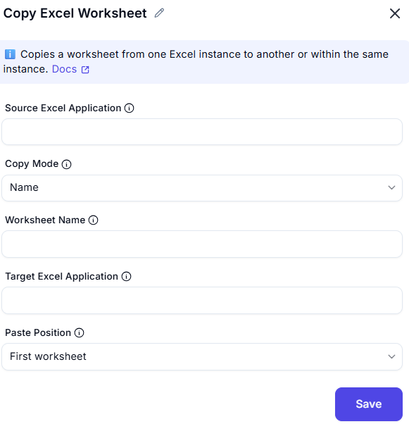

# Copy Excel Worksheet

## Description
This dialog allows users to copy a specific worksheet from one Excel instance to another or within the same workbook. Users can identify the worksheet by either its name or index and specify the target location for the copied sheet.

## Fields and Options

### 1. Source Excel Application
- A dropdown list where users select an active Excel instance.  
- Ensures that the copying action is applied to the correct workbook.  

### 2. Copy Mode
- A dropdown allowing users to choose between copying by **Name** or **Index**.  
- Selecting "Name" enables the **Worksheet Name** field.  
- Selecting "Index" enables the **Worksheet Index** field.    

### 4. Worksheet Name 
- A text input field for specifying the sheet name (if copying by name is selected).  
- The name should match exactly as it appears in Excel.  

### 5. Target Excel Application
- A dropdown list where users select the target Excel instance where the worksheet will be copied.  
- If left blank, the sheet will be copied within the same workbook.  

### 6. Paste Position  
- A text input field where users enter the new name for the copied worksheet **First worksheet** or **Last worksheet**.  

## Use Cases  

- Duplicating a worksheet for backup or testing purposes.  
- Copying a worksheet to another Excel instance for data transfer.  
- Creating templates by copying existing worksheets with predefined formats.  

## Summary  

The **Copy Excel Worksheet** dialog provides a simple interface for duplicating a worksheet within the same workbook or transferring it to another Excel instance. Users can copy the sheet by specifying its name or index, ensuring flexibility in automation workflows.  