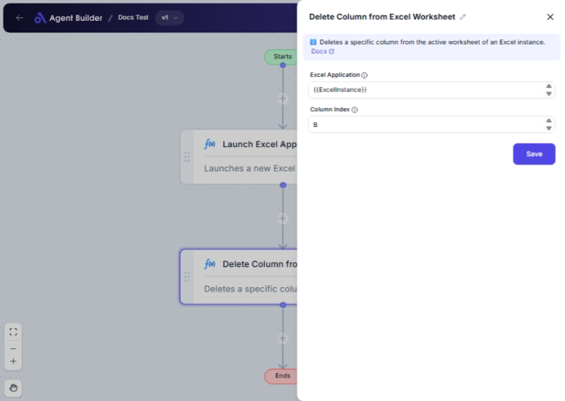

import { Callout, Steps } from "nextra/components";

# Delete Column from Excel Worksheet

The **Delete Column from Excel Worksheet** node allows you to easily remove a specific column from an Excel worksheet. This is particularly useful for cleaning up data, ensuring only relevant information is present, or preparing Excel sheets for further analysis and reporting.

For example:

- Removing unnecessary data columns.
- Simplifying worksheets by removing obsolete information.
- Preparing Excel data for specific analyses or sharing.

## Configuration Options

| Field Name            | Description                                                                              | Input Type | Required? | Default Value |
| --------------------- | ---------------------------------------------------------------------------------------- | ---------- | --------- | ------------- |
| **Excel Application** | The Excel Application object that contains the worksheet you want to modify.             | Text       | Yes       | _(empty)_     |
| **Column Index**      | The index (starting from 1) or letter (e.g., 'A', 'B') of the column you want to delete. | Text       | Yes       | _(empty)_     |

## Expected Output Format

This node does not produce a standalone output. Instead, it modifies the existing worksheet by removing the specified column.

## Step-by-Step Guide

<Steps>
### Step 1

Add the **Delete Column from Excel Worksheet** node to your flow.

### Step 2

In the **Excel Application** field, specify the Excel Application object connected to the worksheet you intend to modify.

### Step 3

In the **Column Index** field, enter the index or letter of the column you wish to delete.

Example:

- To delete the first column, enter `1` or `A`.
- For the second column, enter `2` or `B`.

### Step 4

Confirm the selections to apply the change and remove the indicated column from the worksheet.

</Steps>

<Callout type="info" title="Note">
  Make sure you are confident that the column you are deleting does not contain
  critical data, as this action cannot be undone through this node.
</Callout>

## Input/Output Examples

| Excel Application | Column Index | Action Taken         |
| ----------------- | ------------ | -------------------- |
| App1              | A            | First column deleted |
| App2              | 3            | Third column deleted |

## Common Mistakes & Troubleshooting

| Problem                              | Solution                                                                                                                                   |
| ------------------------------------ | ------------------------------------------------------------------------------------------------------------------------------------------ |
| **Excel Application field is empty** | Ensure you reference the correct Excel Application object that contains your target worksheet.                                             |
| **Invalid Column Index entered**     | Double-check the Column Index input for accuracy. Use numeric (1, 2, 3...) or letter (A, B, C...) values to specify the column accurately. |
| **Unintended column deletion**       | Verify the column index carefully before confirming deletion, especially if using numeric inputs which are 1-based.                        |

## Real-World Use Cases

- **Data Cleanup**: Quickly remove unnecessary columns from large datasets before importing them into data analysis tools.
- **Template Management**: Customize Excel templates by deleting placeholder columns not needed for each use case.
- **Report Simplification**: Streamline Excel reports by eliminating columns that clutter the view without adding value.
