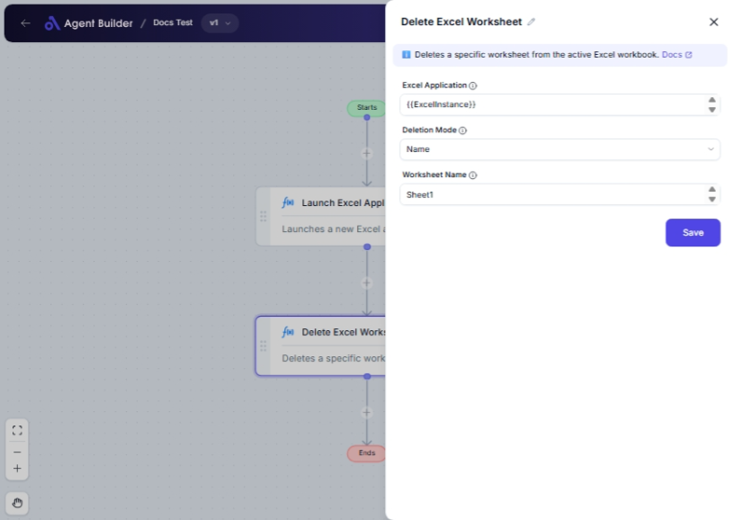

import { Callout, Steps } from "nextra/components";

# Delete Excel Worksheet

The **Delete Excel Worksheet** node enables you to remove a specific worksheet from an Excel file. This can be done either by specifying the worksheet's name or its position (index) within the workbook. This feature is useful when you need to automate the cleanup or restructuring of Excel workbooks, removing unnecessary or outdated worksheets without manual intervention.

## Configuration Options

| Field Name            | Description                                                                       | Input Type | Required? | Default Value |
| --------------------- | --------------------------------------------------------------------------------- | ---------- | --------- | ------------- |
| **Excel Application** | The Excel Application object containing the target worksheet.                     | Text       | Yes       | _(empty)_     |
| **Deletion Mode**     | Specifies how to identify the worksheet to delete: by Name or Index.              | Select     | Yes       | Name          |
| **Worksheet Name**    | The name of the worksheet to delete. Required if using "Name" in Deletion Mode.   | Text       | No        | _(empty)_     |
| **Worksheet Index**   | The index of the worksheet to delete. Required if using "Index" in Deletion Mode. | Text       | No        | _(empty)_     |

## Expected Output Format

This node does not produce a direct data output but modifies the Excel workbook by removing the specified worksheet.

## Step-by-Step Guide

<Steps>
### Step 1

Add the **Delete Excel Worksheet** node to your flow.

### Step 2

Enter the Excel Application object in the **Excel Application** field that contains the worksheet you wish to delete.

### Step 3

Select how you would like to identify the worksheet for deletion using the **Deletion Mode** dropdown:

- **Name**: Specify the worksheet to delete using its name.
- **Index**: Use the worksheet's position (index) in the workbook.

### Step 4

If you selected **Name** in the Deletion Mode, provide the worksheet's name in the **Worksheet Name** field.

### Step 5

If you selected **Index** in the Deletion Mode, provide the worksheet's index in the **Worksheet Index** field.

### Step 6

Once the appropriate fields are completed, the node will execute and delete the specified worksheet from the Excel file.

</Steps>

<Callout type="info" title="Note">
  The fields **Worksheet Name** and **Worksheet Index** are conditional; one
  becomes available based on the selected option in **Deletion Mode**.
</Callout>

## Common Mistakes & Troubleshooting

| Problem                                | Solution                                                                                         |
| -------------------------------------- | ------------------------------------------------------------------------------------------------ |
| **Missing Worksheet Name/Index Field** | Ensure you have selected the correct Deletion Mode (Name or Index) to reveal the required field. |
| **Worksheet Not Found**                | Double-check the worksheet name or index for accuracy. The worksheet must exist to be deleted.   |
| **Excel Application Object Missing**   | The input must be an Excel Application object to access and delete its worksheets.               |

## Real-World Use Cases

- **Monthly Reports**: Delete outdated sheets from monthly financial Excel reports.
- **Template Cleanup**: Automatically remove placeholder sheets from Excel-based templates after they have been populated.
- **Data Processing**: Remove specific sheets used for data processing to maintain only the final result in shared documents.
