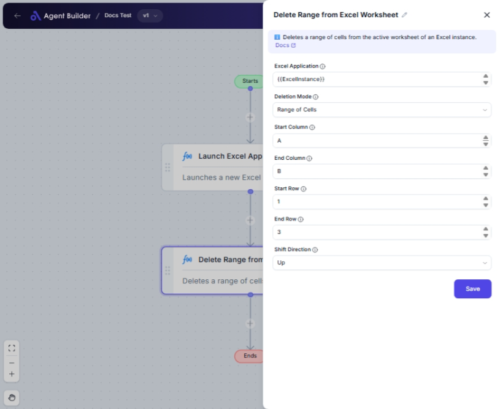

import { Callout, Steps } from "nextra/components";

# Delete Range from Excel Worksheet

The **Delete Range from Excel Worksheet** node allows you to remove specific cells or a range of cells from a worksheet in an Excel file. This can be particularly useful for cleaning up data, removing unnecessary information, or preparing the worksheet for further analysis or reporting.

## Configuration Options

| Field Name            | Description                                                                       | Input Type | Required? | Default Value |
| --------------------- | --------------------------------------------------------------------------------- | ---------- | --------- | ------------- |
| **Excel Application** | The Excel Application object containing the target worksheet.                     | Text       | Yes       | _(empty)_     |
| **Deletion Mode**     | Specifies how to delete cells: either a single cell or a range of cells.          | Select     | Yes       | RangeOfCells  |
| **Start Column**      | The starting column of the range to delete. _Only available if deleting a range._ | Text       | No        | _(empty)_     |
| **End Column**        | The ending column of the range to delete. _Only available if deleting a range._   | Text       | No        | _(empty)_     |
| **Start Row**         | The starting row of the range to delete. _Only available if deleting a range._    | Text       | No        | _(empty)_     |
| **End Row**           | The ending row of the range to delete. _Only available if deleting a range._      | Text       | No        | _(empty)_     |
| **Shift Direction**   | Specifies how to shift remaining cells: either up or left after deletion.         | Select     | No        | Up            |

## Expected Output Format

There is no explicit output from this node. The action directly modifies the Excel worksheet within the provided Excel Application object.

## Step-by-Step Guide

<Steps>
### Step 1

Add the **Delete Range from Excel Worksheet** node into your flow.

### Step 2

In the **Excel Application** field, provide the Excel Application object that contains the worksheet you wish to modify.

### Step 3

Select the **Deletion Mode** from the dropdown:

- **Single Cell**: Deletes a specific cell.
- **Range of Cells**: Deletes a specific range of cells (e.g., from A1 to B10).

### Step 4

If you selected **Range of Cells**, input details for the range:

- **Start Column**: Enter the first column of the range.
- **End Column**: Enter the last column of the range.
- **Start Row**: Enter the first row of the range.
- **End Row**: Enter the last row of the range.

### Step 5

Choose the **Shift Direction** to specify how remaining cells should adjust after deletion. Options are **Up** or **Left**.

### Step 6

Ensure all required fields are filled, then execute to apply the changes to your Excel sheet.

</Steps>

<Callout type="info" title="Tip">
  When choosing to delete a range, make sure the **Start Column/Row** and **End
  Column/Row** fields are correctly set to ensure the intended cells are
  deleted.
</Callout>

## Input/Output Examples

| Deletion Mode  | Start Column | End Column | Start Row | End Row | Shift Direction | Result                                        |
| -------------- | ------------ | ---------- | --------- | ------- | --------------- | --------------------------------------------- |
| Single Cell    | _(n/a)_      | _(n/a)_    | _(n/a)_   | _(n/a)_ | Up              | Only the specific cell is deleted.            |
| Range of Cells | A            | B          | 1         | 10      | Left            | Cells from A1 to B10 are deleted, shift left. |

## Common Mistakes & Troubleshooting

| Problem                              | Solution                                                                                         |
| ------------------------------------ | ------------------------------------------------------------------------------------------------ |
| **Fields Not Showing**               | Ensure you select the correct **Deletion Mode** for additional fields to appear.                 |
| **Excel Application Object Missing** | Verify that a valid Excel Application object is provided and it includes the target worksheet.   |
| **Incorrect Range Deletion**         | Double-check the range configuration in **Start/End Column and Row** fields.                     |
| **Unexpected Cell Shifting**         | Confirm **Shift Direction** is set correctly to avoid unexpected adjustments of remaining cells. |

## Real-World Use Cases

- **Data Cleanup**: Remove placeholder or unnecessary data from periodic sales reports before analysis.
- **Template Preparation**: Delete specific headers or footers from template worksheets before populating with new data.
- **Data Correction**: Clear misfed data range inputs after data import to reset analysis worksheets.
