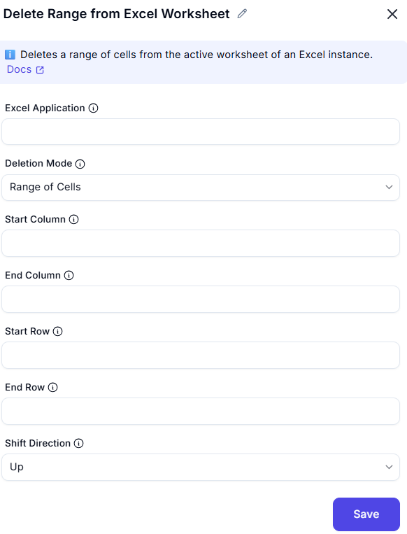

# Delete Range From Excel Worksheet

## Description  

This dialog allows users to delete values from an Excel worksheet by specifying the start and end column and row values. Users can choose to delete a single cell or a range of cells.

## Fields and Options  

### 1. Excel Application
- A dropdown list to select the active Excel instance.  
- Ensures the operation is performed on the correct workbook.  

### 2. Deletion Mode
- Specifies how to delete cells: Single Cell or Range of Cells.
  - Range of Cells
  - Single Cell

### 3. Start Column
- Specifies the column index of the first cell in the range to be deleted.  

### 4. Start Row 
- Specifies the row index of the first cell in the range to be deleted.  

### 5. End Column
- Specifies the column index of the last cell in the range to be deleted.  

### 6. End Row
- Specifies the row index of the last cell in the range to be deleted.  

### 7. Shift Direction
- Specifies how to shift remaining cells after deletion.

## Use Cases  
- Removing outdated or unnecessary data from an Excel worksheet.  
- Automating the clearing of specific cells or ranges in a structured dataset.  
- Ensuring clean and accurate data by deleting unwanted values.  

## Summary  
The **Delete from Excel Worksheet** dialog provides an interface for removing values from an Excel sheet, either from a single cell or a defined range. Users can specify the deletion area to ensure precise data removal for automation and data management.  