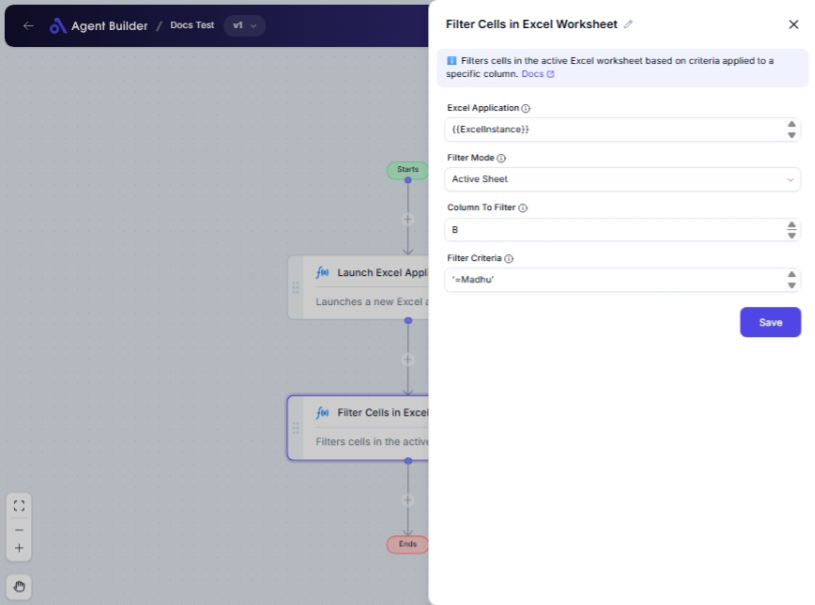

import { Callout, Steps } from "nextra/components";

# Filter Cells in Excel Worksheet

The **Filter Cells in Excel Worksheet** node helps you efficiently manage data within an Excel worksheet by applying filters to select specific data. This is particularly useful for extracting relevant information based on set conditions, making your data analysis or reporting more targeted and streamlined.

Some examples include:

- Filtering data on the active sheet for quick views.
- Specifying ranges or using named cells to focus on specific areas.
- Applying criteria to an Excel table for more structured data management.

## Configuration Options

| Field Name            | Description                                                                                 | Input Type | Required? | Default Value |
| --------------------- | ------------------------------------------------------------------------------------------- | ---------- | --------- | ------------- |
| **Excel Application** | The Excel Application object containing the target worksheet.                               | Text       | Yes       | _(empty)_     |
| **Filter Mode**       | Specifies the method to apply filters: Active Sheet, Specific Range, Named Cells, or Table. | Select     | Yes       | ActiveSheet   |
| **Start Column**      | The starting column of the range to filter (if 'Filter Mode' is 'Specific Range').          | Text       | No        | _(empty)_     |
| **End Column**        | The ending column of the range to filter (if 'Filter Mode' is 'Specific Range').            | Text       | No        | _(empty)_     |
| **Start Row**         | The starting row of the range to filter (if 'Filter Mode' is 'Specific Range').             | Text       | No        | _(empty)_     |
| **End Row**           | The ending row of the range to filter (if 'Filter Mode' is 'Specific Range').               | Text       | No        | _(empty)_     |
| **Named Cells**       | The name of the named range to filter (if 'Filter Mode' is 'NamedCells').                   | Text       | No        | _(empty)_     |
| **Table Name**        | The name of the table to filter (if 'Filter Mode' is 'Table').                              | Text       | No        | _(empty)_     |
| **Column To Filter**  | The column letter (e.g., 'A', 'B') or number (e.g., 1, 2) to apply the filter on.           | Text       | Yes       | _(empty)_     |
| **Filter Criteria**   | The condition to apply for filtering, e.g., '=Apple', '&gt;10', '&lt;>Complete'.            | Text       | Yes       | _(empty)_     |

## Expected Output Format

The output of this node is the **filtered Excel data**, which includes only the data meeting your specified criteria.

## Step-by-Step Guide

<Steps>
### Step 1

Add the **Filter Cells in Excel Worksheet** node to your flow.

### Step 2

Enter the **Excel Application** representing the worksheet you want to filter.

### Step 3

Select the **Filter Mode** from the dropdown: choose to apply filters on the active sheet, a specific range, named cells, or a table.

- For **Specific Range**, fill in the start/end columns and rows.
- For **Named Cells**, provide the name of the named range.
- For **Table**, provide the table name.

### Step 4

In the **Column To Filter** field, specify the column where the filter should be applied.

### Step 5

Set your **Filter Criteria** to determine what data should be shown (e.g., `=Apples` to show only rows with "Apples" in the specified column).

### Step 6

The filtered worksheet data will now reflect the criteria specified.

</Steps>

<Callout type="info" title="Note">
  Ensure that your Excel worksheet and application are correctly selected to
  avoid errors. Fields dependent on conditions appear dynamically according to
  your **Filter Mode** choice.
</Callout>

## Common Mistakes & Troubleshooting

| Problem                                                | Solution                                                                                                             |
| ------------------------------------------------------ | -------------------------------------------------------------------------------------------------------------------- |
| **No data is shown after filtering**                   | Review your **Filter Criteria** to make sure it matches the data. Check column selection and ensure data exists.     |
| **Wrong columns/rows filtered on Specific Range Mode** | Verify that start and end columns/rows are correctly specified. Confirm the range is within your worksheet's bounds. |
| **Necessary fields are not appearing**                 | Check if you've set the correct **Filter Mode**. Additional fields are conditional based on your selection.          |

## Real-World Use Cases

- **Sales Reports**: Filter out sales data for specific regions using named ranges.
- **Inventory Management**: Use specific criteria to track high-demand inventory items.
- **Data Cleaning**: Isolate entries that need correction or follow-ups in large datasets.
