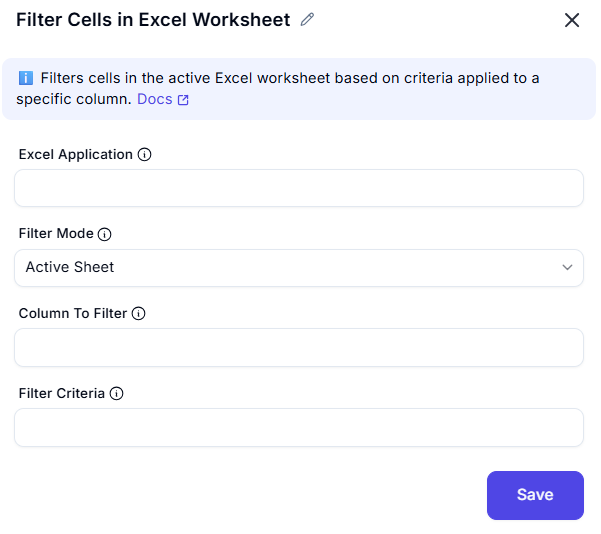

# Filter Cells in Excel Worksheet  

## Description  
This feature allows users to filter data in an Excel worksheet based on specific criteria. It is useful for narrowing down data to focus on relevant information during automation workflows.  

## Fields and Options  

### 1. Excel Instance   
- Select the Excel instance (workbook) where the filtering will be applied.  
- This ensures the action is performed on the correct workbook.  

### 2. Filter Mode   
- Choose where to apply the filter:  
  - **Active Sheet**: Apply the filter to the currently active worksheet.  
  - **Table Name**: Apply the filter to a specific table within the worksheet.  
  - **Range**: Apply the filter to a specific range of cells.  
  - **Named Cells**: Apply the filter to a named range of cells.  

### 6. Column To Filter
- Enter the starting column for the filter range (e.g., `A`, `B`, `1`, `2`).  

### 11. Filters Criteria
- Define the filter conditions to apply (e.g., `Equals`, `Contains`, `Greater Than`).  

## Use Cases  
- Filtering data in a worksheet to focus on specific rows or columns.  
- Automating data analysis by applying filters based on predefined criteria.  
- Preparing data for reporting or further processing by narrowing down relevant information.  

## Summary  
The **Filter Cells in Excel Worksheet** action provides a way to filter data in an Excel worksheet based on specific columns, rows, and filter conditions. It ensures precise control over data visibility, making it ideal for automation and analysis tasks.  