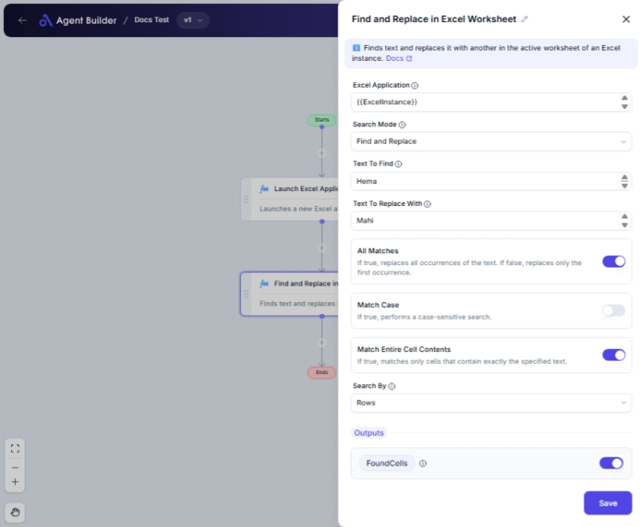

import { Callout, Steps } from "nextra/components";

# Find and Replace in Excel Worksheet

The **Find and Replace in Excel Worksheet** node allows you to search for specific text in an Excel worksheet and optionally replace it with another text. This can be particularly useful when you need to update cell contents quickly or ensure consistency in data by finding and replacing text across your spreadsheet.

For example:

- Quickly finding all instances of a specific name and replacing it with a corrected spelling.
- Searching for all outdated terms and replacing them with newer ones in a worksheet.

## Configuration Options

| Field Name                     | Description                                                                                         | Input Type | Required? | Default Value |
| ------------------------------ | --------------------------------------------------------------------------------------------------- | ---------- | --------- | ------------- |
| **Excel Application**          | The Excel Application object containing the target worksheet.                                       | Text       | Yes       | _(empty)_     |
| **Search Mode**                | Specifies whether to perform a just-find or a find-and-replace operation.                           | Select     | Yes       | Find          |
| **Text To Find**               | The specific text or value you want to search for in the worksheet.                                 | Text       | No        | _(empty)_     |
| **Text To Replace With**       | The text or value to replace the found text with. Only needed if "Search Mode" is Find and Replace  | Text       | No        | _(empty)_     |
| **All Matches**                | If true, all occurrences of the text are replaced; if false, only the first occurrence is replaced. | Switch     | No        |               |
| **Match Case**                 | If true, performs a case-sensitive search.                                                          | Switch     | No        |               |
| **Match Entire Cell Contents** | If true, matches only cells that contain exactly the specified text.                                | Switch     | No        |               |
| **Search By**                  | Specifies whether to search by rows or columns.                                                     | Select     | No        | Rows          |

## Expected Output Format

The output of this node varies based on configuration:

- **Found Cells**: A list of all matched cell references if "All Matches" is true.
- **Found Column Index**: The column index of the found cell if only the first match is needed.
- **Found Row Index**: The row index of the found cell if only the first match is needed.

## Step-by-Step Guide

<Steps>
### Step 1

Add **Find and Replace in Excel Worksheet** node into your workflow.

### Step 2

In the **Excel Application** field, enter the reference to the Excel Application containing your target worksheet.

### Step 3

In the **Search Mode** dropdown, choose **Find** if you want to locate text or **Find and Replace** if you want to replace found text.

### Step 4

Enter the value in **Text To Find** field that you want to search in the worksheet.

### Step 5

If you selected **Find and Replace**, complete the **Text To Replace With** field with the replacement text.

### Step 6

Toggle **All Matches** to true if you wish to replace all occurrences, otherwise toggle false for the first occurrence only.

### Step 7

Optionally, toggle **Match Case** if a case-sensitive match is required.

### Step 8

Optionally, toggle **Match Entire Cell Contents** for exact cell content matches.

### Step 9

Select **Search By** as **Rows** or **Columns** depending on your search preference.

### Step 10

Review your input and connect the node to the subsequent nodes to utilize outputs like **FoundCells**, **FoundColumnIndex**, or **FoundRowIndex**.

</Steps>

<Callout type="info" title="Note">
  When using "Find and Replace," make sure the "Text To Replace With" field is
  filled; otherwise, the replace operation might not perform as expected.
</Callout>

## Input/Output Examples

| Search Mode    | Text To Find | Text To Replace With | All Matches | Match Case | Found Cells / Index                          |
| -------------- | ------------ | -------------------- | ----------- | ---------- | -------------------------------------------- |
| Find           | "Sample"     | _(n/a)_              | _(n/a)_     | False      | A list of cells with "Sample"                |
| Find & Replace | "OldTerm"    | "NewTerm"            | True        | True       | A list of all cells replaced with "NewTerm"  |
| Find           | "Example"    | _(n/a)_              | _(n/a)_     | True       | Column index or row index of the first match |

## Common Mistakes & Troubleshooting

| Problem                                        | Solution                                                                                                |
| ---------------------------------------------- | ------------------------------------------------------------------------------------------------------- |
| **Text To Replace With not needed but filled** | Ensure that "Text To Replace With" is only completed when "Search Mode" is set to **Find and Replace**. |
| **Unintended cells being matched**             | Verify settings like **Match Case** and **Match Entire Cell Contents** to ensure precise matches.       |
| **Output values not as expected**              | Double-check if **All Matches** is correctly set according to your needs for replacing.                 |

## Real-World Use Cases

- **Data Cleansing**: Search for and standardize different spellings of a name or term across a worksheet.
- **Report Updates**: Find all outdated terms in a financial report and replace them with current terminology efficiently.
- **Inventory Sheets**: Quickly adjust product names or descriptions across combined sheets, ensuring uniformity.
