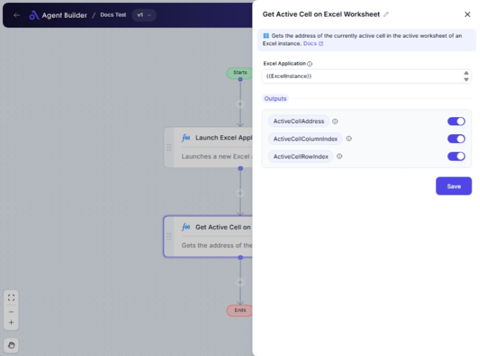

import { Callout, Steps } from "nextra/components";

# Get Active Cell on Excel Worksheet

The **Get Active Cell on Excel Worksheet** node is designed to help you identify the active cell within an Excel worksheet quickly. This is especially useful when you need to know the exact location of a cell that is selected or being interacted with in a financial report, data analysis, or any Excel-based task.

Whether you're working on tracking where data is entered or automating tasks based on cell positions, this node provides crucial information about the active cell's address, and both its column and row indices.

{/*  */}

## Configuration Options

| Field Name                   | Description                                                   | Input Type | Required? | Default Value         |
| ---------------------------- | ------------------------------------------------------------- | ---------- | --------- | --------------------- |
| **Excel Application**        | The Excel Application object containing the target worksheet. | Text       | Yes       | _(empty)_             |
| **Active Cell Address**      | Outputs the address of the active cell (e.g., 'A1').          | Output     | No        | ActiveCellAddress     |
| **Active Cell Column Index** | Outputs the column index of the active cell.                  | Output     | No        | ActiveCellColumnIndex |
| **Active Cell Row Index**    | Outputs the row index of the active cell.                     | Output     | No        | ActiveCellRowIndex    |

## Expected Output Format

The node outputs details about the active cell in the following formats:

- **Active Cell Address**: A string indicating the cell address (e.g., `A1`).
- **Active Cell Column Index**: A number representing the column of the active cell (e.g., `1` for column A).
- **Active Cell Row Index**: A number representing the row of the active cell (e.g., `1` for the first row).

## Step-by-Step Guide

<Steps>
### Step 1

Add **Get Active Cell on Excel Worksheet** node into your flow.

### Step 2

In the **Excel Application** field, enter the reference or name of the Excel application object you are working with. Ensure this is correctly set to access the desired worksheet.

### Step 3

The node will automatically output the **Active Cell Address**, **Active Cell Column Index**, and **Active Cell Row Index**. You can utilize these outputs in subsequent nodes for further automation or data handling.

</Steps>

<Callout type="info" title="Note">
  Ensure that the Excel Application object is properly initialized and refers to
  an open and accessible worksheet with an active cell.
</Callout>

## Input/Output Examples

| Input Field       | Example Value    |
| ----------------- | ---------------- |
| Excel Application | MyExcelAppObject |

| Output Field             | Example Value | Output Type           |
| ------------------------ | ------------- | --------------------- |
| Active Cell Address      | A1            | String                |
| Active Cell Column Index | 1             | Number (Column Index) |
| Active Cell Row Index    | 1             | Number (Row Index)    |

## Common Mistakes & Troubleshooting

| Problem                                         | Solution                                                                                                                          |
| ----------------------------------------------- | --------------------------------------------------------------------------------------------------------------------------------- |
| **Invalid or Missing Excel Application Object** | Make sure you enter a valid Excel Application object. The node needs to access an active workbook and worksheet.                  |
| **Output Values Not Updating**                  | Verify that the Excel worksheet is currently active and the cell you wish to check is selected.                                   |
| **Disconnected Node**                           | Ensure that the worksheet is accessible and try restarting the Excel application or re-establishing the connections if necessary. |

## Real-World Use Cases

- **Automated Data Entry Validation**: Verify the cell being edited and log its address to track data entry points.
- **Dynamic Report Generation**: Determine the location of interactions to format reports automatically based on the active cell.
- **Spreadsheet Navigation Feedback**: Provide users feedback about where they are within a large dataset for improved navigation experiences.
