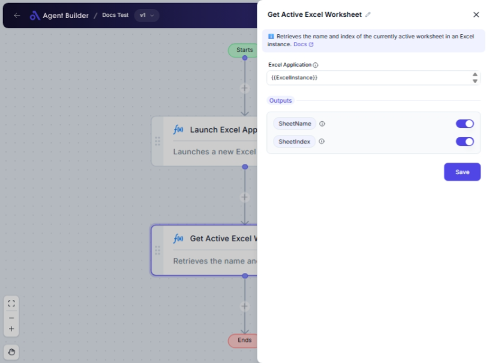

import { Callout, Steps } from "nextra/components";

# Get Active Excel Worksheet

The **Get Active Excel Worksheet** node is designed to help you easily identify the worksheet that is currently active or in use within an Excel application. This is particularly useful when managing multiple worksheets in a workbook and needing to direct workflows or operations to the active sheet specifically.

By using this node, you can automate processes that depend on or specifically target the active sheet in an Excel workbook.

{/*  */}

## Configuration Options

| Field Name            | Description                                                  | Input Type | Required? | Default Value |
| --------------------- | ------------------------------------------------------------ | ---------- | --------- | ------------- |
| **Excel Application** | The Excel Application object containing the target workbook. | Text       | Yes       | _(empty)_     |

## Expected Output Format

The output provides two pieces of information:

- **Sheet Name**: A text string representing the currently active worksheet's name.
- **Sheet Index**: A number indicating the position of the active worksheet within the workbook.

## Step-by-Step Guide

<Steps>
### Step 1

Add **Get Active Excel Worksheet** node into your flow.

### Step 2

In the **Excel Application** field, input the Excel Application object that contains your target workbook. This step ensures that the node is aware of the Excel context you are working within.

### Step 3

Once configured, the node will output the **Sheet Name** and **Sheet Index** of the active worksheet. You can use these outputs in other parts of your workflow as needed.

### Step 4

Run the automation to retrieve the active worksheet information.

</Steps>

<Callout type="info" title="Note">
  Ensure that the Excel application is open and the workbook is loaded before
  using this node to get accurate results.
</Callout>

## Input/Output Examples

| Excel Application  | Output Sheet Name | Output Sheet Index |
| ------------------ | ----------------- | ------------------ |
| MyExcelAppObject   | "Sales Q1"        | 1                  |
| AnotherExcelObject | "Summary"         | 3                  |

## Common Mistakes & Troubleshooting

| Problem                         | Solution                                                                                                                         |
| ------------------------------- | -------------------------------------------------------------------------------------------------------------------------------- |
| **Excel Application not found** | Double-check that your Excel application is open and the object name is correctly referenced in the **Excel Application** field. |

## Real-World Use Cases

- **Financial Reports Automation**: Automatically retrieve and process data from the active worksheet in a complex financial workbook.
- **Data Comparison**: Use the active worksheet data for immediate analysis against another dataset in a dynamic report.
- **Inventory Updates**: Directly update inventory records on the active sheet without needing to specify which sheet manually.
