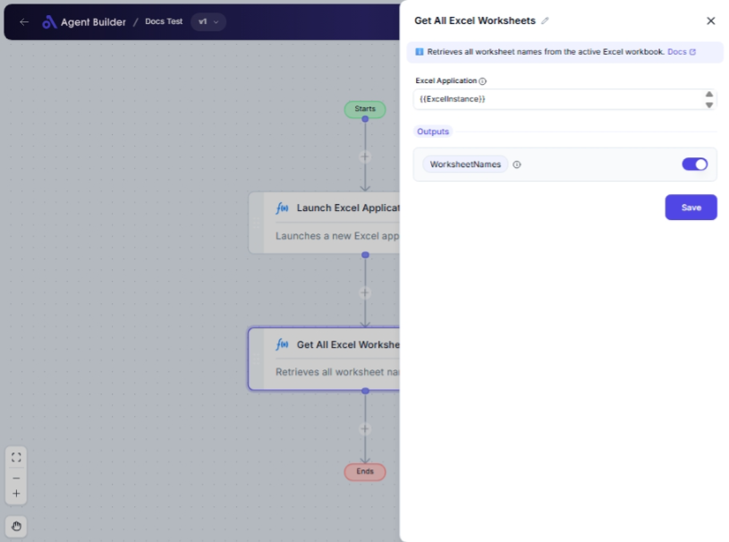

import { Callout, Steps } from "nextra/components";

# Get All Excel Worksheets

The **Get All Excel Worksheets** node is used to retrieve the names of all worksheets within a specified Excel workbook. This node is particularly useful when you need to perform operations on multiple sheets or verify the contents of a workbook before proceeding with further actions in your workflow.

Some examples of when to use this node include:

- Managing large Excel workbooks by checking sheet names.
- Automating processes that involve multiple worksheets.
- Preparing data by identifying sheet layout before importing or transforming.

{/*  */}

## Configuration Options

| Field Name            | Description                                                  | Input Type | Required? | Default Value |
| --------------------- | ------------------------------------------------------------ | ---------- | --------- | ------------- |
| **Excel Application** | The Excel Application object containing the target workbook. | Text       | Yes       | _(empty)_     |

## Expected Output Format

The output is a **list of strings**, where each string represents the name of a worksheet in the Excel workbook. This output is stored as **WorksheetNames**.

## Step-by-Step Guide

<Steps>

### Step 1

Add **Get All Excel Worksheets** node into your flow.

### Step 2

In the **Excel Application** field, enter the Excel Application object that contains your target workbook.

### Step 3

Once configured, the node will output a list of all worksheet names under the **WorksheetNames** label. You can use this data in subsequent nodes to reference specific sheets in your workflow.

</Steps>

<Callout type="info" title="Important">
  Ensure that your Excel Application object is correctly specified and open, as
  the node requires access to the target workbook to retrieve worksheet names.
</Callout>

## Input/Output Examples

| Excel Application | Output (Worksheet Names)       | Output Type     |
| ----------------- | ------------------------------ | --------------- |
| Workbook1         | ["Sheet1", "Sheet2", "Sheet3"] | List of Strings |
| BudgetReport      | ["Summary", "Q1", "Q2", "Q3"]  | List of Strings |

## Common Mistakes & Troubleshooting

| Problem                             | Solution                                                                                            |
| ----------------------------------- | --------------------------------------------------------------------------------------------------- |
| **Excel Application not specified** | Ensure the **Excel Application** field is populated with an appropriate Excel Application object.   |
| **Node outputs empty list**         | Verify that the workbook is correctly opened and accessible. Check that it contains any worksheets. |

## Real-World Use Cases

- **Monthly Reporting**: Quickly gather worksheet names for monthly data aggregation processes.
- **Data Integrity Checks**: Verify that expected sheets are present in a complex data import workflow.
- **Dynamic Data Processing**: Automate processing across multiple unspecified or varying worksheets.
