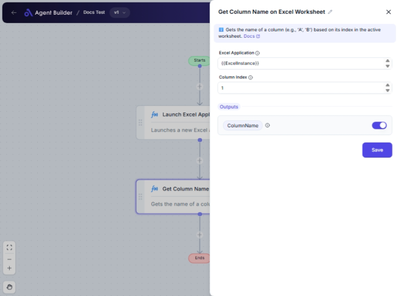

import { Callout, Steps } from "nextra/components";

# Get Column Name on Excel Worksheet

The **Get Column Name on Excel Worksheet** node is designed for converting a numeric column index to its corresponding letter representation in an Excel worksheet. This feature is particularly useful when you need to dynamically reference or label columns that are specified by index numbers, such as in scripting or when automating tasks with Excel data.

This node is beneficial when you're dealing with scenarios like:

- Generating column headings programmatically.
- Ensuring consistency in report generation.
- Automating processes that depend on specific Excel column references.

{/*  */}

## Configuration Options

| Field Name            | Description                                                           | Input Type | Required? | Default Value |
| --------------------- | --------------------------------------------------------------------- | ---------- | --------- | ------------- |
| **Excel Application** | The Excel Application object containing the target worksheet.         | Text       | Yes       | _(empty)_     |
| **Column Index**      | The 1-based index of the column to convert to a letter (e.g., 1 → A). | Text       | Yes       | _(empty)_     |

## Expected Output Format

The output of this node is a **string value** representing the column letter as per Excel's standard labeling.

- For a column index of `1`, the output will be `"A"`.
- For a column index of `26`, the output will be `"Z"`.
- For a column index of `27`, the output will be `"AA"`.

## Step-by-Step Guide

<Steps>
### Step 1

Add the **Get Column Name on Excel Worksheet** node to your flow.

### Step 2

In the **Excel Application** field, input the identifier for the Excel application containing the worksheet you're working with.

### Step 3

In the **Column Index** field, enter the 1-based column index number that you wish to convert into an Excel column letter.

### Step 4

Once configured, the node will output the corresponding column letter as **ColumnName**, which you can use for subsequent operations.

</Steps>

<Callout type="info" title="Tip">
  Make sure the index provided is within the valid range for Excel columns.
  Exceeding Excel's range will not convert to a valid column name.
</Callout>

## Input/Output Examples

| Column Index | Output Value | Output Type |
| ------------ | ------------ | ----------- |
| 1            | "A"          | String      |
| 5            | "E"          | String      |
| 28           | "AB"         | String      |

## Common Mistakes & Troubleshooting

| Problem                            | Solution                                                                                       |
| ---------------------------------- | ---------------------------------------------------------------------------------------------- |
| **Incorrect column index entered** | Ensure you enter a valid 1-based column index. Negative numbers or zero will result in errors. |
| **Output not being recognized**    | Double-check that the output **ColumnName** is properly connected for further use in the flow. |

## Real-World Use Cases

- **Data Importing**: Automatically identify and label columns when importing data sets for analysis or processing.
- **Report Generation**: Dynamically generate column headers for monthly reports without manually typing each letter.
- **Spreadsheet Automation**: Convert index-based column references into Excel-compatible letters when scripting or creating macros.
