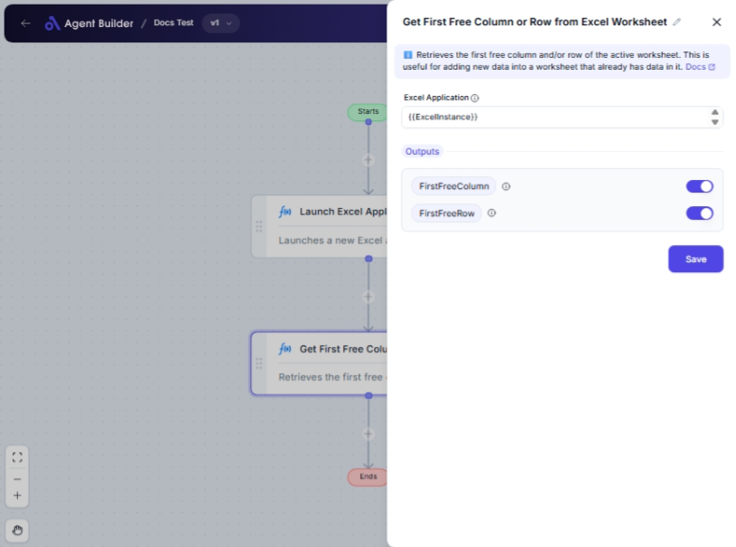

import { Callout, Steps } from "nextra/components";

# Get First Free Column or Row from Excel Worksheet

The **Get First Free Column or Row from Excel Worksheet** node helps you quickly identify the first empty column or row in a specific Excel worksheet. This is particularly useful for tasks such as data entry, analysis, and ensuring that new data does not overwrite existing information.

For example:

- Automatically identify where to start entering new data without overwriting existing content.
- Efficiently set up subsequent nodes in your workflow for data input operations.

## Configuration Options

| Field Name            | Description                                                   | Input Type | Required? | Default Value   |
| --------------------- | ------------------------------------------------------------- | ---------- | --------- | --------------- |
| **Excel Application** | The Excel Application object containing the target worksheet. | Text       | Yes       | _(empty)_       |
| **First Free Column** | Returns the first free column as a letter (e.g., 'A', 'B').   | Output     | No        | FirstFreeColumn |
| **First Free Row**    | Returns the first free row as a number.                       | Output     | No        | FirstFreeRow    |

## Expected Output Format

The outputs from this node are straightforward:

- **First Free Column**: This is output as a **letter** representing the first vacant column in the worksheet (e.g., `C`).
- **First Free Row**: This is output as a **number** indicating the first empty row available (e.g., `5`).

## Step-by-Step Guide

<Steps>
### Step 1

Add **Get First Free Column or Row from Excel Worksheet** node into your flow.

### Step 2

In the **Excel Application** field, input the Excel Application object that includes your target worksheet.

### Step 3

After setting up your flow, the node will determine the first free column and row automatically.

### Step 4

You can use the values of **First Free Column** and **First Free Row** in your subsequent tasks or nodes.

</Steps>

<Callout type="info" title="Note">
  Ensure that your Excel Application is correctly set up and points to the
  desired worksheet before using this node to get accurate results.
</Callout>

## Input/Output Examples

| Excel Application | First Free Column | First Free Row |
| ----------------- | ----------------- | -------------- |
| Workbook1         | C                 | 5              |

## Common Mistakes & Troubleshooting

| Problem                                   | Solution                                                                                             |
| ----------------------------------------- | ---------------------------------------------------------------------------------------------------- |
| **Incorrect Excel Application reference** | Double-check that the Excel Application object correctly points to the file and sheet you are using. |
| **Unexpected output**                     | Ensure there are no hidden or merged cells affecting the detection of the first free column/row.     |

## Real-World Use Cases

- **Data Management**: Quickly find where new data can be appended in routine data entry tasks.
- **Automated Reporting**: Use free row/column information to insert additional analysis or annotations.
- **Template Initialization**: Prepare an Excel sheet by instantly locating the next available column or row for quick setup.
