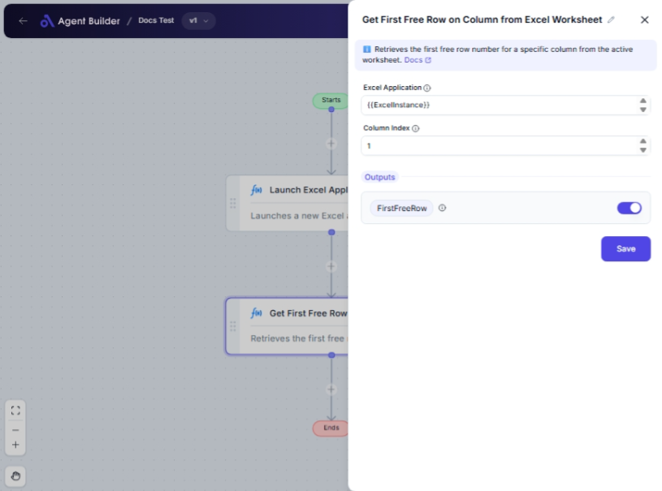

import { Callout, Steps } from "nextra/components";

# Get First Free Row on Column from Excel Worksheet

The **Get First Free Row on Column from Excel Worksheet** node is designed to help you identify the first available (empty) row in a specified column of an Excel worksheet. This is useful when you need to find where you can add new data without overwriting existing entries. It can be particularly beneficial in managing dynamic data entries, ensuring that new data is appended appropriately.

## Configuration Options

| Field Name            | Description                                                                       | Input Type | Required? | Default Value |
| --------------------- | --------------------------------------------------------------------------------- | ---------- | --------- | ------------- |
| **Excel Application** | The Excel Application object containing the target worksheet.                     | Text       | Yes       | _(empty)_     |
| **Column Index**      | The 1-based index of the column to check for the first free row in the worksheet. | Text       | Yes       | _(empty)_     |
| **First Free Row**    | Returns the first free row number in the specified column.                        | Output     | No        | FirstFreeRow  |

## Expected Output Format

The node outputs the **first row number** that is free (empty) in the specified column. The output is a **number** representing the row index.

## Step-by-Step Guide

<Steps>
### Step 1

Add the **Get First Free Row on Column from Excel Worksheet** node into your flow.

### Step 2

In the **Excel Application** field, specify the Excel application object that contains your target worksheet.

### Step 3

Enter the **Column Index** for which you want to find the first free row. This is a 1-based index, meaning that `1` represents the first column (A), `2` represents the second column (B), and so on.

### Step 4

After the node processes, the **First Free Row** output will provide the row number that is the first available space in the specified column.

</Steps>

<Callout type="info" title="Note">
  Ensure that the column index is entered correctly as a number, corresponding
  to the column's position in Excel.
</Callout>

## Input/Output Examples

| Column Index | Input Excel Data                   | Output Value | Output Type      |
| ------------ | ---------------------------------- | ------------ | ---------------- |
| 1            | Data in rows 1-5, empty from row 6 | 6            | Number (Integer) |
| 2            | Data in rows 1-3, empty at rows 4  | 4            | Number (Integer) |

## Common Mistakes & Troubleshooting

| Problem                    | Solution                                                                                                                     |
| -------------------------- | ---------------------------------------------------------------------------------------------------------------------------- |
| **Incorrect Column Index** | Verify the column index is correct and corresponds to the desired column. The index should be 1-based.                       |
| **Worksheet Not Found**    | Ensure the Excel Application object is correctly configured and has access to the intended worksheet.                        |
| **Unexpected Output**      | Double-check the worksheet data and ensure that data entries are fully occupying expected rows before the reported free row. |

## Real-World Use Cases

- **Data Entry Automation**: Automatically find the next free row to append data in a tracking spreadsheet.
- **Resource Allocation**: Utilize the first free row to allocate resources dynamically in Excel-based systems.
- **Inventory Management**: Identify where to input new stock data in an existing inventory list without overwriting.
