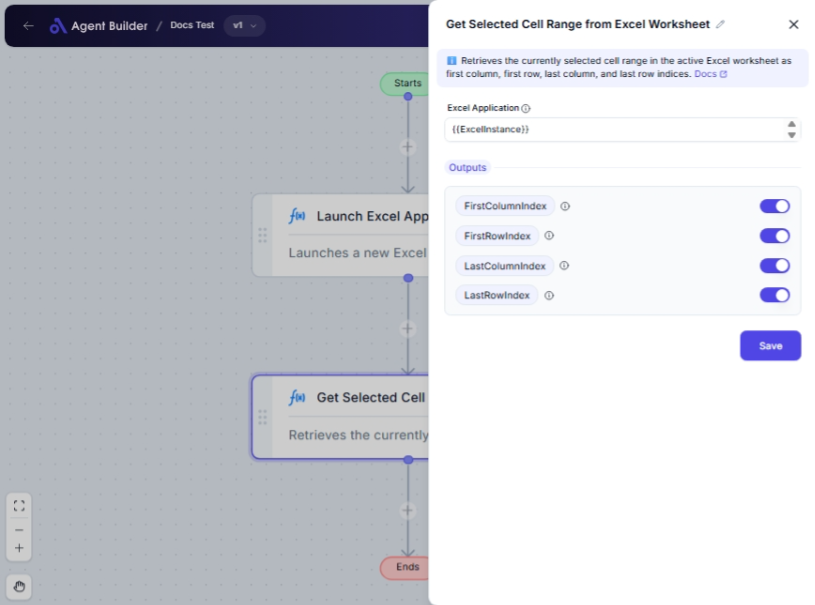

import { Callout, Steps } from "nextra/components";

# Get Selected Cell Range from Excel Worksheet

The **Get Selected Cell Range from Excel Worksheet** node allows you to identify and capture specific data from an Excel sheet by retrieving the range of selected cells. Use this node to determine which cells are active in your spreadsheet workflows, making subsequent data processing steps more streamlined and precise.

This node provides you with the indexes of the first and last columns and rows of the active selection, facilitating easy integration with other processes that depend on Excel data inputs.

## Configuration Options

| Field Name             | Description                                                                 | Input Type | Required? | Default Value    |
| ---------------------- | --------------------------------------------------------------------------- | ---------- | --------- | ---------------- |
| **Excel Application**  | The Excel Application object containing the target worksheet.               | Text       | Yes       | _(empty)_        |
| **First Column Index** | Returns the column index (1-based) of the first cell in the selected range. | Output     | No        | FirstColumnIndex |
| **First Row Index**    | Returns the row index (1-based) of the first cell in the selected range.    | Output     | No        | FirstRowIndex    |
| **Last Column Index**  | Returns the column index (1-based) of the last cell in the selected range.  | Output     | No        | LastColumnIndex  |
| **Last Row Index**     | Returns the row index (1-based) of the last cell in the selected range.     | Output     | No        | LastRowIndex     |

## Expected Output Format

The output values from this node are integers representing indices:

- **First Column Index**: An integer value indicating the starting column of the selected range.
- **First Row Index**: An integer value indicating the starting row of the selected range.
- **Last Column Index**: An integer value indicating the ending column of the selected range.
- **Last Row Index**: An integer value indicating the ending row of the selected range.

## Step-by-Step Guide

<Steps>
### Step 1

Add the **Get Selected Cell Range from Excel Worksheet** node to your flow.

### Step 2

In the **Excel Application** field, specify the Excel Application object that contains the worksheet you are working with.

### Step 3

Once configured, the node will output the indices of the selected cell range in the workbook, including **First Column Index**, **First Row Index**, **Last Column Index**, and **Last Row Index**.

### Step 4

Use the output values to enhance subsequent nodes or processes in your workflow that require precise knowledge of the selected data range.

</Steps>

<Callout type="warning" title="Note">
  Ensure that the Excel worksheet you are working with is correctly linked and
  active at the time of range selection to avoid unexpected results.
</Callout>

## Input/Output Examples

| Input Excel Range | First Column Index | First Row Index | Last Column Index | Last Row Index |
| ----------------- | ------------------ | --------------- | ----------------- | -------------- |
| A1:B2             | 1                  | 1               | 2                 | 2              |
| C3:D5             | 3                  | 3               | 4                 | 5              |

## Common Mistakes & Troubleshooting

| Problem                                      | Solution                                                                             |
| -------------------------------------------- | ------------------------------------------------------------------------------------ |
| **Excel Application not linked properly**    | Verify the Excel object connection to ensure it points to the correct workbook.      |
| **Output indices do not match actual range** | Make sure that the Excel worksheet is selected and active when retrieving the range. |

## Real-World Use Cases

- **Data Import Processes**: Streamline data import processes from Excel into another system by automating the extraction of selected ranges.
- **Reporting and Analytics**: Select specific areas of a worksheet for targeted data analysis and reporting.
- **Complex Formulas**: Automate selection of cell ranges for use in dynamic calculations or formula applications within Excel workflows.
