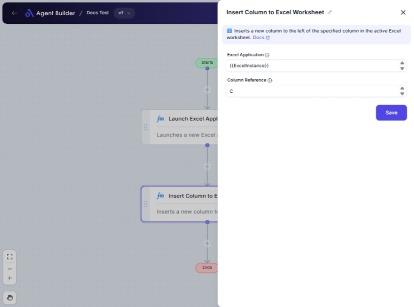

import { Callout, Steps } from "nextra/components";

# Insert Column to Excel Worksheet

The **Insert Column to Excel Worksheet** node allows you to add an empty column to a specified Excel worksheet at a location you define. This is particularly useful for preparing Excel sheets for data entry or restructuring data such that you maintain format and structure.

For example:

- Inserting new columns to accommodate additional data fields.
- Setting up template worksheets where dynamic column additions are necessary.
- Organizing data by splitting sections with new columns.

{/*  */}

## Configuration Options

| Field Name            | Description                                                                                 | Input Type | Required? | Default Value |
| --------------------- | ------------------------------------------------------------------------------------------- | ---------- | --------- | ------------- |
| **Excel Application** | The application object containing the Excel sheet where you want to insert the new column.  | Text       | Yes       | _(empty)_     |
| **Column Reference**  | Specifies the location in the worksheet for inserting the new column using index or letter. | Text       | Yes       | _(empty)_     |

## Expected Output Format

The output from this node is **void**, as its function is to insert a column into the specified worksheet, altering its structure but not yielding a preview or data output.

## Step-by-Step Guide

<Steps>

### Step 1

Add the **Insert Column to Excel Worksheet** node to your workflow.

### Step 2

In the **Excel Application** field, specify the Excel application or workbook instance that contains the worksheet where you plan to insert the column.

### Step 3

In the **Column Reference** field, enter the reference for where the new column should be inserted. This can be either a column number (starting from 1) or a letter (e.g., `A`, `B`).

### Step 4

Check to ensure all required fields are filled correctly.

### Step 5

Run your workflow to insert the column at the specified location in your Excel worksheet.

</Steps>

<Callout type="info" title="Note">
  Remember that entering a non-existent column reference, such as a letter
  beyond the last column of the worksheet, will result in an error.
</Callout>

## Common Mistakes & Troubleshooting

| Problem                               | Solution                                                                                                            |
| ------------------------------------- | ------------------------------------------------------------------------------------------------------------------- |
| **Missing Excel Application**         | Ensure you have provided a valid Excel application object instance in the **Excel Application** field.              |
| **Incorrect Column Reference Format** | Use either a numeric index or correct letter representation; avoid mixing formats like "1B".                        |
| **Column Already Exists**             | This node inserts a new column and will shift existing columns; ensure there is space or check your sheet capacity. |

## Real-World Use Cases

- **Data Import Templates**: Insert columns before importing data that requires extra fields for processing.
- **Automated Report Layouts**: Quickly adjust report structures by adding necessary columns programmatically.
- **Dynamic Spreadsheet Management**: React to changing data requirements by scriptedly adjusting columns in worksheets.
