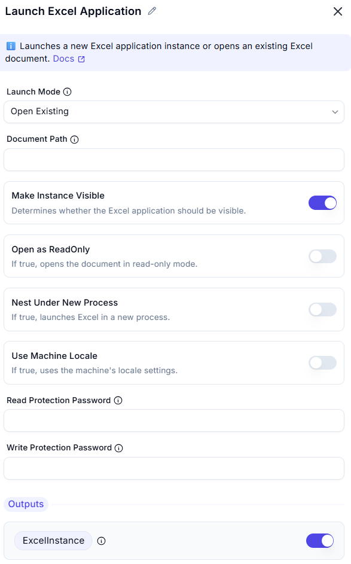

# Launch Excel  

## Description
This feature allows users to launch an instance of Microsoft Excel with a blank document or an existing file. It provides options to control the visibility of the instance and whether the document is opened in read-only mode.  

  

## Fields and Options  

### 1. Launch Excel
- Select how Excel should be launched:
  - **With a blank document** (default)  
  - **With an existing document** (if selected, the user must provide a file path)  

### 2. Document Path
- The path to the Excel document to open. Required if 'Launch Mode' is 'Open Existing'.

### 3. Make Instance Visible
- Toggle option to **show or hide** the Excel window.  
- If enabled, Excel opens in a visible mode for user interaction.  
- If disabled, Excel runs in the background.  

### 4. Open as Readonly 
- Toggle option to **open the document in read-only mode**.  
- If enabled, changes cannot be saved to the original file.  

### 5. Nest Under New Process
 - If true, launches Excel in a new process
### 6. Use Machine Locale
 - If true, uses the machine's locale settings.

### 7. Read Protection Password
 - Optional password to protect the document from being modified.

### 8. Write Protection Password
 - Optional password to protect the document from being saved.

## Use Cases
- Automating Excel-related tasks in the background.  
- Preventing accidental edits by opening files in read-only mode.  
- Running Excel scripts or macros without user interaction.  

## Summary
The **Launch Excel** feature helps automate Excel usage by providing control over instance visibility and file access mode.  
Users can choose to start with a blank document or an existing file, depending on their workflow needs.  