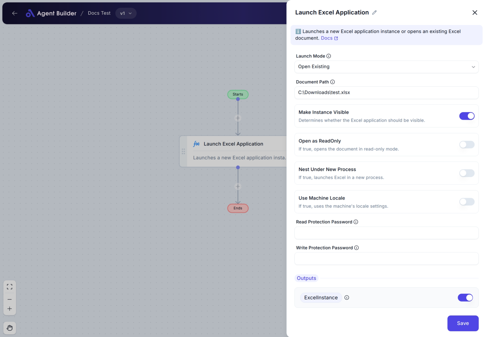

import { Callout, Steps } from "nextra/components";

# Launch Excel

The **Launch Excel** node allows you to start an Excel application as part of your automation flow. You can choose to either open an existing Excel file or create a brand-new workbook. This is useful when you need to read data from, write data to, or perform operations on Excel files within your automation.

For example:

- Open an existing report for editing or data extraction.
- Create a new workbook to generate reports or data summaries.
- Open Excel in the background or make it visible for user interaction.

## Configuration Options

| Field Name                    | Description                                                                                                              | Input Type | Required? | Default Value |
| ----------------------------- | ------------------------------------------------------------------------------------------------------------------------ | ---------- | --------- | ------------- |
| **Launch Mode**               | Choose whether to open an existing Excel file or create a new one.                                                       | Select     | No        | OpenExisting  |
| **Document Path**             | The full file path to the Excel document you want to open. Required if **Launch Mode** is set to **Open Existing**.      | Text       | No        | _(empty)_     |
| **Make Instance Visible**     | Determines whether the Excel window should be visible on screen.                                                         | Switch     | No        | true          |
| **Open as ReadOnly**          | Open the document in read-only mode to prevent accidental edits. Only available if **Launch Mode** is **Open Existing**. | Switch     | No        | _(empty)_     |
| **Nest Under New Process**    | Launches Excel in a completely new process, isolating it from other Excel instances.                                     | Switch     | No        | _(empty)_     |
| **Use Machine Locale**        | Use your computer’s regional settings for the Excel instance.                                                            | Switch     | No        | _(empty)_     |
| **Read Protection Password**  | Optional password to restrict reading access to the file. Only available if **Launch Mode** is **Open Existing**.        | Text       | No        | _(empty)_     |
| **Write Protection Password** | Optional password to restrict saving or modifying the file. Only available if **Launch Mode** is **Open Existing**.      | Text       | No        | _(empty)_     |

## Expected Output Format

The output of this node is an **Excel Application Object** named **ExcelInstance**.

- This represents the running instance of Excel (either with a new workbook or an opened file).
- You can use this output in other nodes to perform Excel-specific tasks like reading, writing, or modifying data.

**Output Name**: `ExcelInstance`

## Step-by-Step Guide

<Steps>
### Step 1

Add the **Launch Excel** node into your automation flow.

### Step 2

In the **Launch Mode** dropdown, choose:

- **Open Existing**: Opens an existing Excel file.
- **New Workbook**: Creates a brand-new empty Excel file.

### Step 3

If you selected **Open Existing**, the following additional fields will appear:

- **Document Path**: Enter the full file path of the Excel file you want to open.
- **Open as ReadOnly**: Enable this if you want the file to open in read-only mode.
- **Read Protection Password**: (Optional) Enter a password to protect file reading.
- **Write Protection Password**: (Optional) Enter a password to protect file saving.

### Step 4

Adjust these optional settings as needed:

- **Make Instance Visible**: Turn on if you want the Excel window to be visible to the user. Turn off to run Excel in the background.
- **Nest Under New Process**: Turn on to launch Excel in a separate, isolated process.
- **Use Machine Locale**: Turn on to apply your computer's regional settings.

### Step 5

Once configured, the running Excel application will be available as **ExcelInstance** for use in subsequent nodes.

</Steps>

<Callout type="info" title="Tip">
  If you only want to create a new empty Excel file without opening an existing
  one, simply select **New Workbook** in the **Launch Mode** dropdown. The other
  file-related fields will not appear.
</Callout>

## Input/Output Examples

| Scenario                          | Launch Mode   | Document Path           | Open as ReadOnly | Output Value  | Output Type              |
| --------------------------------- | ------------- | ----------------------- | ---------------- | ------------- | ------------------------ |
| Open an existing Excel file       | Open Existing | `C:\Reports\Sales.xlsx` | On               | ExcelInstance | Excel Application Object |
| Create a new blank Excel workbook | New Workbook  | _(n/a)_                 | _(n/a)_          | ExcelInstance | Excel Application Object |

## Common Mistakes & Troubleshooting

| Problem                              | Solution                                                                                                                                                           |
| ------------------------------------ | ------------------------------------------------------------------------------------------------------------------------------------------------------------------ |
| **Document Path field not visible**  | Make sure **Launch Mode** is set to **Open Existing**. The path field only appears in this mode.                                                                   |
| **File fails to open**               | Double-check the **Document Path**. Make sure the path exists, the file is not in use by another program, and the file extension is correct (e.g., `.xlsx`).       |
| **Excel does not show up on screen** | Confirm that **Make Instance Visible** is turned **On** if you want to see the Excel window.                                                                       |
| **Cannot save or edit the file**     | If the file opens in **ReadOnly** mode or has **Write Protection Password** enabled, edits may not be allowed unless proper permissions or passwords are provided. |

## Real-World Use Cases

- **Generate a Fresh Report**: Automatically create a new Excel workbook for daily or weekly reports without manual file creation.
- **Open a Template for Data Entry**: Launch an existing Excel template file to populate with data pulled from other systems.
- **Background Data Processing**: Open Excel in the background (invisible to the user) for reading or writing data in large batch operations.
- **Protect Sensitive Files**: Use read and write protection passwords to safeguard confidential Excel documents during automated processing.
