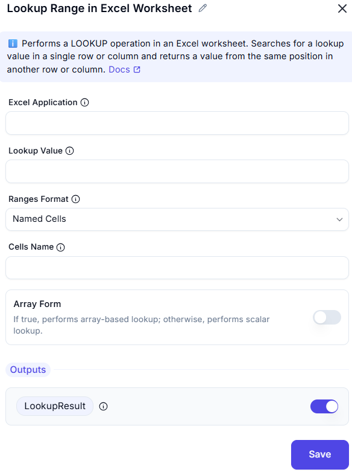

# Lookup Range in Excel Worksheet

## Description
This activity is used in **RPA workflows** (like Power Automate Desktop) to perform a **lookup** operation within an Excel worksheet. It searches for a value in a specified row or column and returns the value from the same position in another row or column.

  
---

### Fields and Option 

| **Field**            | **Description** |
|----------------------|------------------|
| `Excel Application`  | The Excel instance where the lookup is to be performed. Usually passed from a previously launched Excel activity. |
| `Lookup Value`       | The value that needs to be searched in the specified range. |
| `Ranges Format`      | The format of the ranges to be used. Options include: Named Cells (as in the image) Range Addresses Excel Tables |
| `Cells Name`         | The name of the cell(s) or range used for lookup and corresponding return value. Used only when `Ranges Format` is set to "Named Cells". |
| `Array Form`         | If enabled, performs an **array-based lookup** (returns approximate matches). If disabled, does a **scalar (exact)** lookup. |

---
### Outputs

| **Output Variable** | **Description** |
|---------------------|------------------|
| `LookupResult`      | Returns the value found at the same index as the `Lookup Value` in the parallel row/column. |

---
