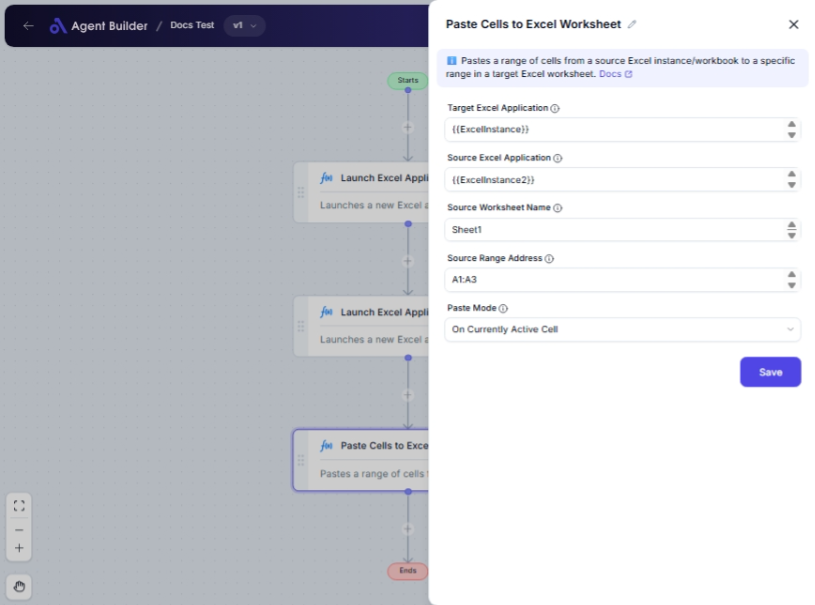

import { Callout, Steps } from "nextra/components";

# Paste Cells to Excel Worksheet

The **Paste Cells to Excel Worksheet** node is designed to help you easily transfer data from a data table into a specified Excel worksheet. This node is ideal when you need to automate data entry into Excel for reporting, data analysis, or any other purpose where data must be moved from a table format to an Excel sheet.

For example:

- Automatically populate a financial report with the latest figures.
- Transfer customer data into an Excel sheet for further processing.
- Load analytics data for visualization in Excel.

{/*  */}

## Configuration Options

| Field Name            | Description                                                          | Input Type | Required? | Default Value |
| --------------------- | -------------------------------------------------------------------- | ---------- | --------- | ------------- |
| **Excel Application** | The Excel Application object containing the target worksheet.        | Text       | Yes       | _(empty)_     |
| **Data Table**        | The DataTable containing the data to paste into the Excel worksheet. | Text       | Yes       | _(empty)_     |
| **Start Row**         | The row number where pasting should start.                           | Text       | Yes       | 1             |
| **Start Column**      | The column number where pasting should start.                        | Text       | Yes       | 1             |

## Expected Output Format

The output for this node is an **Excel worksheet** with the specified data pasted starting at the designated row and column. No additional data types or formats are outputted other than the changes made directly to the Excel application.

## Step-by-Step Guide

<Steps>
### Step 1

Add the **Paste Cells to Excel Worksheet** node to your flow.

### Step 2

In the **Excel Application** field, select or enter the Excel Application object that contains your target worksheet.

### Step 3

In the **Data Table** field, specify the DataTable that holds the data you wish to paste into the worksheet.

### Step 4

In the **Start Row** field, enter the row number where you want the pasting to begin. This determines where your data will start appearing in the Excel sheet.

### Step 5

In the **Start Column** field, specify the column number to begin pasting. This will set the horizontal starting point within the row you specified.

### Step 6

Ensure all configurations are correct and complete for the node to function as expected.

</Steps>

<Callout type="info" title="Tip">
  Double-check that your Excel Application object and DataTable are correctly
  referenced. Errors in these fields could prevent data from being pasted
  correctly.
</Callout>

## Input/Output Examples

| Excel Application | DataTable Label | Start Row | Start Column | Expected Behavior                                                                 |
| ----------------- | --------------- | --------- | ------------ | --------------------------------------------------------------------------------- |
| MyExcelApp        | SalesDataTable  | 1         | 1            | Pastes the contents of `SalesDataTable` starting at A1 in the worksheet.          |
| ReportExcel       | EmployeeTable   | 5         | 2            | Inserts `EmployeeTable` data starting from B5, moving downwards and to the right. |

## Common Mistakes & Troubleshooting

| Problem                              | Solution                                                                                     |
| ------------------------------------ | -------------------------------------------------------------------------------------------- |
| **Data doesn't appear in Excel**     | Verify that the Excel Application and DataTable references are correct and accessible.       |
| **Data pastes in the wrong place**   | Check if the Start Row and Start Column values are correctly set to your intended positions. |
| **Excel workbook is not responding** | Ensure that the Excel Application object is open and properly running before pasting data.   |

## Real-World Use Cases

- **Quarterly Reporting**: Automatically updating specific sectors of a quarterly report stored in Excel with the latest figures from a database.
- **HR Systems**: Pasting recent employee data into an existing HR Excel template for weekly evaluations.
- **Sales Tracking**: Transferring daily sales data into a preformatted Excel worksheet to maintain accurate records and visualizations.
