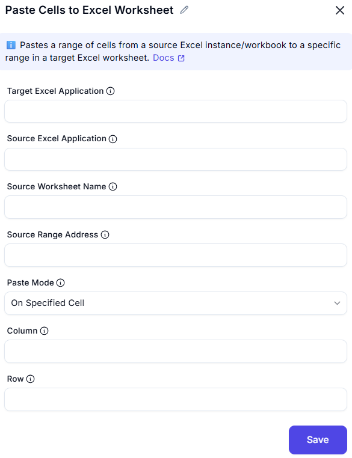

# Paste Cells to Excel Worksheet

## Description  
This dialog allows users to paste copied data into an Excel worksheet at a specified location by defining the column and row values.

## Fields and Options  

### 1. Target Excel Application
- A dropdown list to select the active Excel instance.  
- Ensures the operation is performed on the correct workbook.  

### 2. Source Excel Application
- Defines the mode of pasting. Options may include:  
  - **Values Only** – Pastes only the values from the copied range.  
  - **Values and Formatting** – Pastes values along with cell formatting.  
  - **Formulas** – Pastes formulas from the copied cells.  

### 3. Source worksheet Name
- Name of the worksheet in the source Excel instance containing the data to copy

### 4. Source Range Addresses-
- The range address (e.g., 'A1:B10') in the source worksheet to copy.

### 5. Paste Mode
- Specifies how to determine the paste location

### 6. Column
- Specifies the column index where the data will be pasted.  

### 7. Row
- Specifies the row index where the data will be pasted.  

## Use Cases  
- Pasting copied data into a specific location in an Excel worksheet.  
- Automating data entry by pasting structured data.  
- Maintaining formatting or formulas while pasting data into an Excel sheet.  

## Summary  

The **Paste Cells to Excel Worksheet** dialog provides an interface for pasting copied data into an Excel sheet at a specific location. Users can define the paste mode and target position to ensure accurate data placement for automation.  