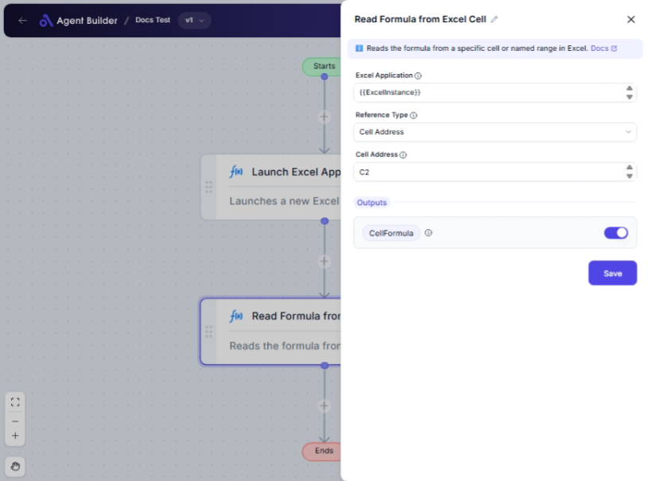

import { Callout, Steps } from "nextra/components";

# Read Formula from Excel Cell

The **Read Formula from Excel Cell** node allows you to retrieve the formula used in a particular Excel cell or a defined named range within an Excel worksheet. This is especially useful when you need to analyze or verify the logic behind a calculated value without manually checking the Excel file.

This node comes in handy when:

- You want to review or audit formulas in a large spreadsheet.
- Automating reports that need to include formula details.
- Extracting formulas as part of a data validation process.

{/*  */}

## Configuration Options

| Field Name            | Description                                                    | Input Type | Required? | Default Value |
| --------------------- | -------------------------------------------------------------- | ---------- | --------- | ------------- |
| **Excel Application** | The Excel Application object containing the target worksheet.  | Text       | Yes       | _(empty)_     |
| **Reference Type**    | Specifies whether to reference by cell address or named range. | Select     | Yes       | CellAddress   |
| **Cell Address**      | The address of the cell to read (e.g., 'A1', 'B2').            | Text       | No        | _(empty)_     |
| **Named Range**       | The name of the range to read the formula from.                | Text       | No        | _(empty)_     |

## Expected Output Format

The output is a **text string** representing the Excel formula extracted from the specified cell or range.

- Example: `=SUM(A1:A10)` would be returned as a text string.

## Step-by-Step Guide

<Steps>

### Step 1

Add **Read Formula from Excel Cell** node into your flow.

### Step 2

In the **Excel Application** field, input your Excel Application object that contains the worksheet.

### Step 3

Select the **Reference Type**:

- **Cell Address**: To specify the exact cell (e.g., 'A1').
- **Named Range**: To reference a cell by a defined range name.

### Step 4

If you selected **Cell Address**, enter the exact cell you wish to read in the **Cell Address** field.

> If you selected **Named Range**, enter the range name in the **Named Range** field instead.

### Step 5

The formula contained in the specified cell or range will be available as **CellFormula** for use in other nodes.

</Steps>

<Callout type="info" title="Tip">
  Ensure your Excel Application object is properly configured and the worksheet
  is accessible. The node will not work with closed or non-existent Excel files.
</Callout>

## Input/Output Examples

| Reference Type | Input        | Output            | Output Type |
| -------------- | ------------ | ----------------- | ----------- |
| Cell Address   | 'A1'         | `=SUM(B1:B10)`    | String      |
| Named Range    | 'TotalSales' | `=SUM(SalesData)` | String      |

## Common Mistakes & Troubleshooting

| Problem                              | Solution                                                                                                   |
| ------------------------------------ | ---------------------------------------------------------------------------------------------------------- |
| **Cell or range not found error**    | Make sure the cell address or named range exists in the specified worksheet.                               |
| **Incorrect Reference Type setting** | Double-check whether you're using a **cell address** or **named range** and select the appropriate option. |
| **Excel Application not loading**    | Verify the Excel Application object's configuration and ensure the worksheet is open and accessible.       |

## Real-World Use Cases

- **Quality Assurance**: Quickly audit formulas in a model spreadsheet to ensure accurate calculations.
- **Financial Analysis**: Extract details of complex formulas for financial planning and analysis reports.
- **Data Validation**: Automatically cross-reference calculated fields across multiple Excel sheets for consistency.
