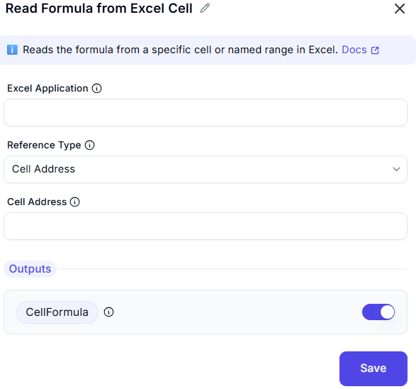

# Read Formula from Excel  

## Description  
This feature allows users to retrieve the formula from a specific cell in an Excel worksheet. It is useful for extracting, analyzing, or debugging formulas within a spreadsheet.  

  

## Fields and Options  

### 1. Excel Application
- A dropdown to select the active Excel instance.  
- Ensures the correct workbook is used for the operation.  

### 2. Reference Type 
- Specifies whether to reference by cell address or named range.
  - **The formula of a single cell** (default)  

### 3. Cell Address
- The address of the cell to read (e.g., 'A1', 'B2').

### 6. **Output**
- Displays the extracted formula from the specified cell.  

## Use Cases  
- Extracting formulas from cells for analysis.  
- Debugging Excel formulas in automation workflows.  
- Checking consistency in spreadsheet calculations.  

## Summary  
The **Read Formula from Excel** feature allows users to fetch the formula from a specific cell, making it useful for debugging, data validation, and automation workflows.