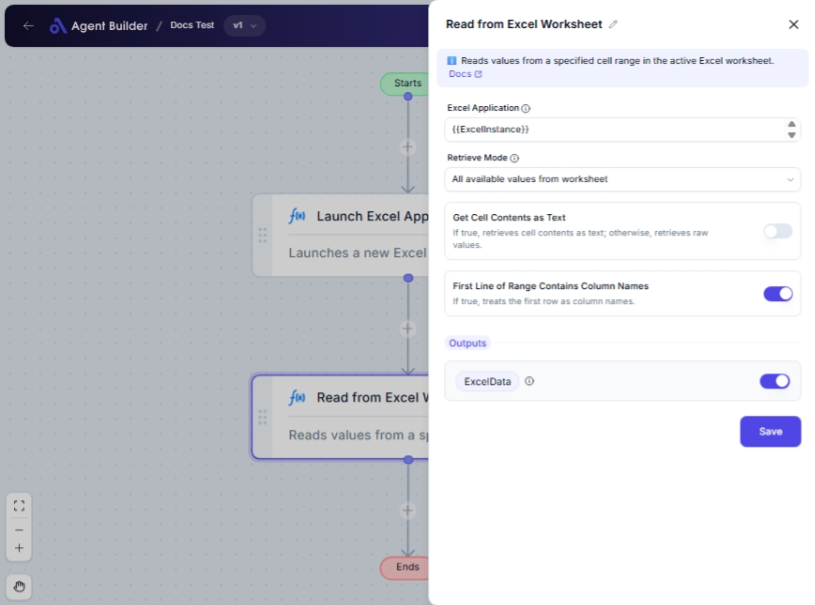

import { Callout, Steps } from "nextra/components";

# Read from Excel Worksheet

The **Read from Excel Worksheet** node enables you to extract data from an Excel worksheet. You can select to read a specific cell, a defined range, or entire selections. This node is particularly useful for importing data from Excel files into your workflow for further processing or analysis.

## Configuration Options

| Field Name                                    | Description                                                                                   | Input Type | Required? | Default Value |
| --------------------------------------------- | --------------------------------------------------------------------------------------------- | ---------- | --------- | ------------- |
| **Excel Application**                         | The Excel Application object containing the target worksheet.                                 | Text       | Yes       | _(empty)_     |
| **Retrieve Mode**                             | Specifies how to retrieve data from the worksheet.                                            | Select     | Yes       | SingleCell    |
| **Start Column**                              | The starting column of the range to read (required if 'Retrieve Mode' is 'Range of Cells').   | Text       | No        | _(empty)_     |
| **Start Row**                                 | The starting row of the range to read (required if 'Retrieve Mode' is 'Range of Cells').      | Text       | No        | _(empty)_     |
| **End Column**                                | The ending column of the range to read (required if 'Retrieve Mode' is 'Range of Cells').     | Text       | No        | _(empty)_     |
| **End Row**                                   | The ending row of the range to read (required if 'Retrieve Mode' is 'Range of Cells').        | Text       | No        | _(empty)_     |
| **Name**                                      | The name of the named range to read (required if 'Retrieve Mode' is 'Values of Named Cells'). | Text       | No        | _(empty)_     |
| **Get Cell Contents as Text**                 | If true, retrieves cell contents as text; otherwise, retrieves raw values.                    | Switch     | No        | _(empty)_     |
| **First Line of Range Contains Column Names** | If true, treats the first row as column names.                                                | Switch     | No        | _(empty)_     |
| **Omit Empty Columns and Rows**               | If true, omits empty columns to the right and empty rows at the bottom.                       | Switch     | No        | _(empty)_     |

## Expected Output Format

The node returns an **Excel Data** output, which is a DataTable containing the data read from the specified Excel range. This can be further used in your workflows for data manipulation.

## Step-by-Step Guide

<Steps>
### Step 1

Add the **Read from Excel Worksheet** node to your flow.

### Step 2

In the **Excel Application** field, specify the Excel application object that contains your target worksheet.

### Step 3

Select the **Retrieve Mode** appropriate for your task:

- **Single Cell**: Reads a specific cell by its column and row indices.
- **Range of Cells**: Reads a specific range (e.g., 'A1:B10').
- **Selection**: Reads the currently selected cells in the worksheet.
- **All Available Values**: Reads all cells in the worksheet.
- **Values of Named Cells**: Reads from a named range in the worksheet.

### Step 4

If you selected **Range of Cells**, fill in the starting and ending columns and rows to define the range.

### Step 5

If you selected **Values of Named Cells**, input the name of the range to extract.

### Step 6

Toggle **Get Cell Contents as Text** if you need the data as text. Otherwise, raw values are extracted.

### Step 7

Enable **First Line of Range Contains Column Names** if your range's first line contains column headers.

### Step 8

Toggle **Omit Empty Columns and Rows** to ignore empty rows or columns if retrieving named cell values.

### Step 9

The extracted data will be available in **Excel Data** output for further use.

</Steps>

<Callout type="info" title="Note">
  Ensure the Excel file is open and accessible when reading data. If unsure
  about range specifics, verify them in the Excel file directly.
</Callout>

## Input/Output Examples

| Retrieve Mode         | Example Range | Get Contents as Text | Output (ExcelData)                      |
| --------------------- | ------------- | -------------------- | --------------------------------------- |
| Single Cell           | A1            | Yes                  | 42 (as text)                            |
| Range of Cells        | A1:B2         | No                   | DataTable with cells A1, A2, B1, B2     |
| Values of Named Cells | Inventory     | Yes                  | DataTable containing named range values |

## Common Mistakes & Troubleshooting

| Problem                                      | Solution                                                                                         |
| -------------------------------------------- | ------------------------------------------------------------------------------------------------ |
| **Range fields not appearing when expected** | Ensure the Retrieve Mode is set to 'Range of Cells' for range-specific fields to become visible. |
| **Data not appearing or inaccurate**         | Verify the Retrieve Mode is correct and check Excel for right cell/column/row references.        |
| **Named range values not fetching**          | Double-check the named range spelling in Excel matches exactly in the node configuration.        |

## Real-World Use Cases

- **Sales Data Analysis**: Gather data from Excel reports to analyze sales trends and performance.
- **Inventory Management**: Retrieve specific inventory listings for real-time inventory checks.
- **Financial Reporting**: Import financial data from Excel sheets for budgeting and forecasting fluidity.
