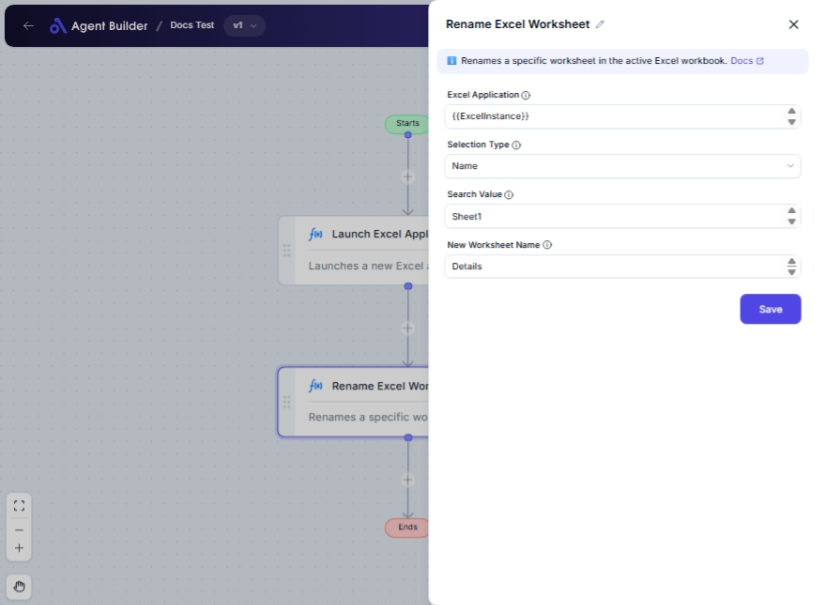

import { Callout, Steps } from "nextra/components";

# Rename Excel Worksheet

The **Rename Excel Worksheet** node allows you to change the name of a specific worksheet within an Excel file. This can be particularly useful for organizing your Excel workbooks by updating outdated or generic worksheet names to something more meaningful and relevant.

For example:

- Changing "Sheet1" to "SalesData_Q1" to better reflect its contents.
- Renaming sheets to maintain a consistent naming convention across multiple files.

## Configuration Options

| Field Name             | Description                                                                               | Input Type | Required? | Default Value |
| ---------------------- | ----------------------------------------------------------------------------------------- | ---------- | --------- | ------------- |
| **Excel Application**  | The Excel Application object containing the target worksheet.                             | Text       | Yes       | _(empty)_     |
| **Selection Type**     | Specifies whether to select the worksheet by Name or Index.                               | Select     | Yes       | Name          |
| **Search Value**       | The worksheet name (if selection type is 'Name') or index (if selection type is 'Index'). | Text       | Yes       | _(empty)_     |
| **New Worksheet Name** | The new name to assign to the selected worksheet.                                         | Text       | Yes       | _(empty)_     |

## Expected Output Format

This node does not produce a direct output value. Instead, it updates the worksheet name within the specified Excel application.

## Step-by-Step Guide

<Steps>
### Step 1

Add the **Rename Excel Worksheet** node to your workflow.

### Step 2

In the **Excel Application** field, enter the object that contains your target worksheet.

### Step 3

Choose how you'll identify the worksheet with the **Selection Type** dropdown:

- **Name**: Select the worksheet by its current name.
- **Index**: Select the worksheet by its position number (starting from 1).

### Step 4

Provide the appropriate **Search Value** depending on the **Selection Type**:

- Enter the current worksheet name if you selected "Name."
- Enter the position number if you selected "Index."

### Step 5

In the **New Worksheet Name** field, type in the new name you want to assign to the worksheet.

### Step 6

Once configured, your Excel worksheet will be renamed to the specified name.

</Steps>

<Callout type="warning" title="Important">
  Ensure the new worksheet name does not contain any invalid characters (*, :,
  ?, /, etc.) and is unique within the workbook.
</Callout>

## Input/Output Examples

- If you select the worksheet by **Name** and want to change "Sheet1" to "SalesData_2023":

  - Selection Type: Name
  - Search Value: Sheet1
  - New Worksheet Name: SalesData_2023

- If you select the worksheet by **Index** and the first sheet is to be renamed to "Summary":
  - Selection Type: Index
  - Search Value: 1
  - New Worksheet Name: Summary

## Common Mistakes & Troubleshooting

| Problem                            | Solution                                                                                                     |
| ---------------------------------- | ------------------------------------------------------------------------------------------------------------ |
| **Worksheet not found**            | Verify that the **Search Value** is correct and matches exactly in name or number as per the selection type. |
| **Duplicate worksheet name error** | Ensure the new worksheet name is unique within the Excel workbook.                                           |
| **Invalid characters in new name** | Double-check the new name for invalid characters and remove them.                                            |

## Real-World Use Cases

- **Monthly Financial Reports**: Rename worksheets each month (e.g., from "CurrentMonth" to "January").
- **Project Management**: Organize project data files by renaming worksheets according to project phases or tasks.
- **Data Analysis**: Modify sheet names to reflect data types or analysis criteria, making it easier to identify specific contents at a glance.
