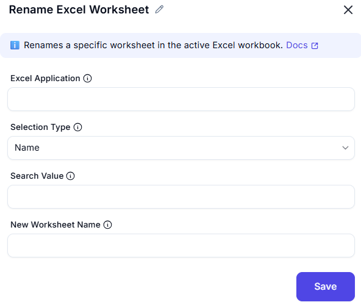

## Resize Columns/Rows in Excel Worksheet

This activity is used to **resize the width of columns** or the **height of rows** in an Excel worksheet. It provides flexibility to adjust layout for readability or formatting purposes.


---

### Fields and Option

| **Field**             | **Description** |
|------------------------|------------------|
| `Excel Application`    | Specifies the Excel instance where the resizing operation will take place. Usually passed from a `Launch Excel` or `Attach Excel` activity. |
| `Resize Target`        | Indicates whether to resize `Columns` or `Rows`. |
| `Selection Range`      | Defines which columns/rows to resize. Options include: All available Active cells Specific range |
| `Resize Type`          | Type of resizing to apply: Fit to content Custom size |
| `Width` or `Height`    | (When `Custom size` is selected) Enter the exact width (for columns) or height (for rows). |

---

### Example Scenario

You want all columns in your Excel sheet to be 25 units wide.

```plaintext
Resize Target: Columns
Selection Range: All available
Resize Type: Custom size
Width: 25
```

This will standardize the column widths across your worksheet, improving alignment.

---
