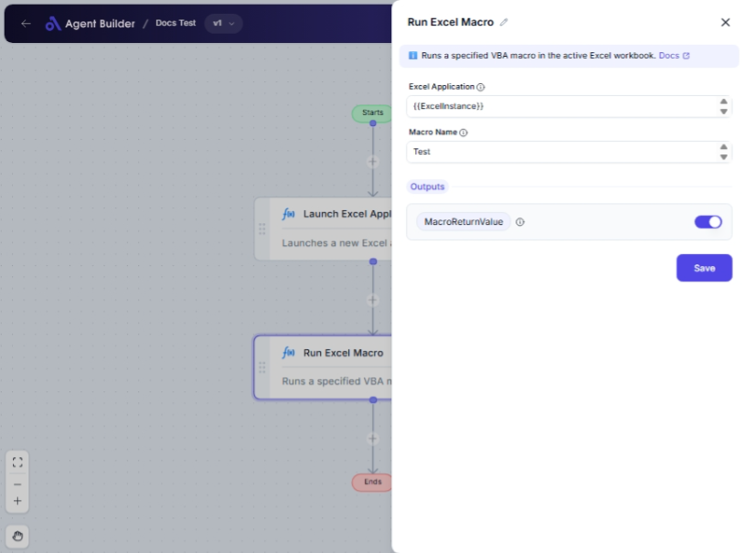

import { Callout, Steps } from "nextra/components";

# Run Excel Macro

The **Run Excel Macro** node allows you to automate processes within Excel by executing a Visual Basic for Applications (VBA) macro. This is useful when you have repetitive tasks or complex calculations that need to be triggered within your Excel workbook.

For example:

- Automating the preparation of financial summaries or reports.
- Applying complex formulas and updates across multiple sheets.
- Streamlining data import/export processes with pre-built scripts.

## Configuration Options

| Field Name            | Description                                                  | Input Type | Required? | Default Value |
| --------------------- | ------------------------------------------------------------ | ---------- | --------- | ------------- |
| **Excel Application** | The Excel Application object containing the target workbook. | Text       | Yes       | _(empty)_     |
| **Macro Name**        | The name of the VBA macro to execute.                        | Text       | Yes       | _(empty)_     |

## Expected Output Format

The output of this node is a **single value** returned by the macro, if any. It can vary based on the macro's coding and return type specified within the VBA script. Typically, it returns a **string** or **numeric value**.

## Step-by-Step Guide

<Steps>
### Step 1

Add the **Run Excel Macro** node into your workflow.

### Step 2

In the **Excel Application** field, enter the reference to the Excel object that holds the workbook where your macro resides.

### Step 3

In the **Macro Name** field, enter the exact name of the macro you want to run. Be sure that this macro exists and is well-configured in the Excel workbook.

### Step 4

Once configured, run the node to execute the macro within the specified Excel application. The output, if any, will be available as **MacroReturnValue**.

</Steps>

<Callout type="warning" title="Important Note">
  Ensure that the macro security settings in Excel permit the execution of
  macros. Otherwise, the macro may not run, and you won't receive the desired
  output.
</Callout>

## Common Mistakes & Troubleshooting

| Problem                                    | Solution                                                                                             |
| ------------------------------------------ | ---------------------------------------------------------------------------------------------------- |
| **Unable to find and execute the macro**   | Confirm the macro name is correctly entered without any typos and exists in the referenced workbook. |
| **Macro does not execute or gives errors** | Check your Excel's macro security settings to allow macro execution.                                 |
| **Unexpected macro result**                | Verify that the macro itself is coded correctly and the workbook is set up as the macro expects.     |

## Real-World Use Cases

- **Report Automation**: Automatically generate monthly reports by executing pre-recorded macros.
- **Data Analysis Prep**: Set up your workbook with necessary calculations and formatting instantly.
- **Complex Task Execution**: Combine several smaller tasks into one macro execution, replacing manual inputs and efforts.
