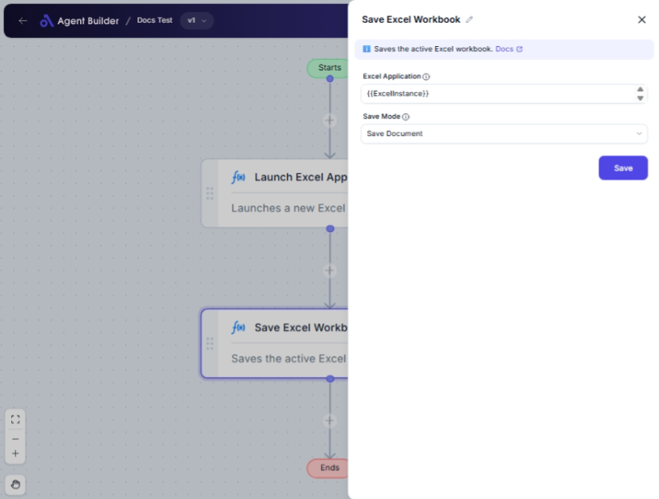

import { Callout, Steps } from "nextra/components";

# Save Excel Workbook

The **Save Excel Workbook** node is designed to help you save your changes in an Excel workbook easily. You can choose to save it in its current state or select a different location and format for your file. This node is particularly useful when working with automated Excel processes, ensuring your work is saved without manual intervention.

{/*  */}

## Configuration Options

| Field Name            | Description                                                                                    | Input Type | Required? | Default Value |
| --------------------- | ---------------------------------------------------------------------------------------------- | ---------- | --------- | ------------- |
| **Excel Application** | The Excel Application object containing the workbook to save.                                  | Text       | Yes       | _(empty)_     |
| **Save Mode**         | Specifies how to save the workbook.                                                            | Select     | Yes       | SaveDocument  |
| **Document Path**     | The file path to save the workbook. Only required if **Save Mode** is **Save Document As**.    | Text       | No        | _(empty)_     |
| **Document Format**   | The file format to save the workbook as. Only needed if **Save Mode** is **Save Document As**. | Select     | No        | _(empty)_     |

## Expected Output Format

There is no direct output from this node. Its function is to save the changes you have made to an Excel workbook.

## Step-by-Step Guide

<Steps>
### Step 1

Add the **Save Excel Workbook** node to your workflow.

### Step 2

In the **Excel Application** field, enter the Excel Application object reference that contains the workbook you wish to save.

### Step 3

Select a **Save Mode** from the dropdown:

- **Save Document**: Saves the workbook in its current format and location.
- **Save Document As**: Allows you to specify a new path and format for saving the workbook.

### Step 4

If you selected **Save Document As** in the **Save Mode**, additional fields become available:

- **Document Path**: Enter the full file path where you want to save the workbook.
- **Document Format**: Choose the format from the dropdown list that suits your needs.

</Steps>

<Callout type="info" title="Important">
  When using **Save Document As**, make sure to provide a valid **Document
  Path** and select an appropriate **Document Format** to avoid errors.
</Callout>

## Input/Output Examples

| Save Mode        | Document Path         | Document Format           | Result                                                     |
| ---------------- | --------------------- | ------------------------- | ---------------------------------------------------------- |
| Save Document    | _(not needed)_        | _(not needed)_            | Workbook is saved in its existing location and format.     |
| Save Document As | C:\MyFiles\Book1.xlsx | Open XML Workbook (.xlsx) | Workbook is saved as Book1.xlsx in the specified location. |

## Common Mistakes & Troubleshooting

| Problem                                                    | Solution                                                                                                    |
| ---------------------------------------------------------- | ----------------------------------------------------------------------------------------------------------- |
| **Errors when not using a valid Excel Application object** | Ensure you input a valid Excel Application object in the **Excel Application** field.                       |
| **Saving fails due to invalid path**                       | Double-check the path entered in **Document Path** if using **Save Document As**.                           |
| **Incorrect file format selection**                        | Ensure you select a compatible format that your Excel version supports in the **Document Format** dropdown. |

## Real-World Use Cases

- **Automated Reporting**: Save completed reports in desired formats automatically after data processing.
- **Data Backup**: Periodically save important Excel files with specific backup formats.
- **Version Control**: Save multiple versions of a workbook with different names or formats for record-keeping.
