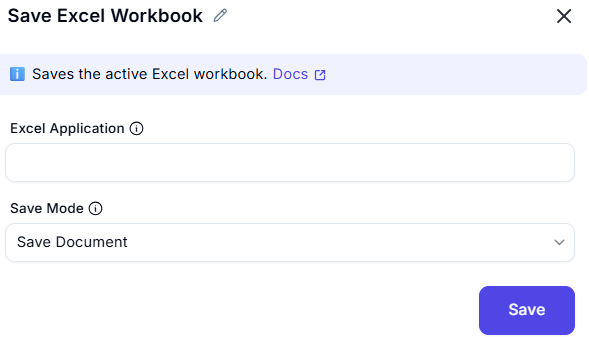

# Save Excel  

## Description

This feature allows users to save an Excel workbook with specific options, such as the save mode, document format, and file path. It is useful for ensuring that changes to a workbook are saved correctly and in the desired format.  

  

## Fields and Options  

### 1. Excel Application
- Select the Excel instance (workbook) to save.  
- This ensures the action is performed on the correct workbook.  

### 2. Save Mode
- Choose how the workbook should be saved (e.g., save changes, save as a new file, or discard changes).  

## Use Cases
- Saving changes to an Excel workbook after automation tasks.  
- Exporting a workbook in a specific format (e.g., `.xlsx`, `.csv`).  
- Saving a workbook to a specific location for further processing or sharing.  

## Summary
The **Save Excel** action provides a way to save an Excel workbook with customizable options, including save mode, document format, and file path. It ensures that workbook changes are preserved and stored in the desired format and location.