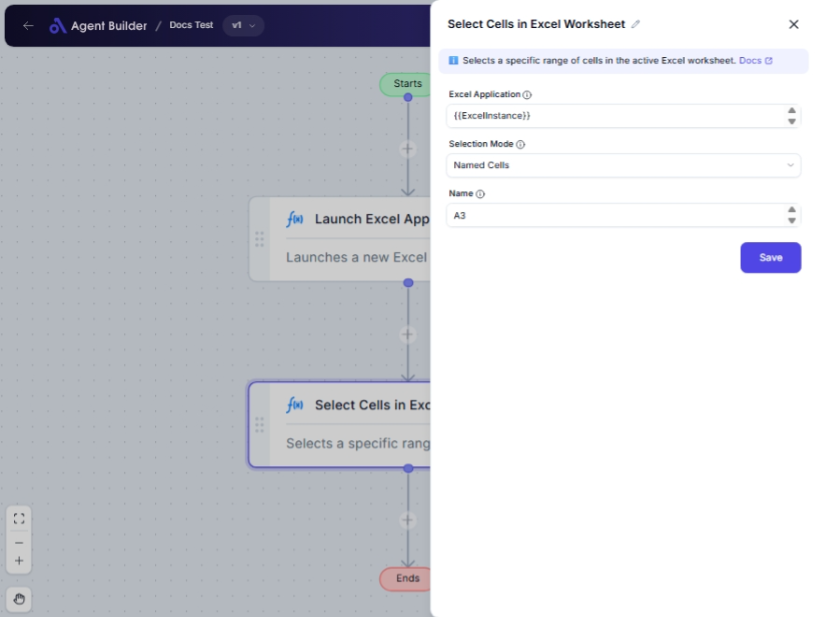

import { Callout, Steps } from "nextra/components";

# Select Cells in Excel Worksheet

The **Select Cells in Excel Worksheet** node allows you to specify and select a range of cells within an Excel worksheet using various methods like named ranges, specific cell ranges, or relative positioning to the active cell. This node is beneficial for tasks where you need to interact with a specific part of an Excel sheet, such as automating data entry, formatting, or analysis.

## Configuration Options

| Field Name            | Description                                                                                                       | Input Type | Required? | Default Value |
| --------------------- | ----------------------------------------------------------------------------------------------------------------- | ---------- | --------- | ------------- |
| **Excel Application** | The Excel Application object containing the target worksheet.                                                     | Text       | Yes       | _(empty)_     |
| **Selection Mode**    | Specifies how to select the cells: Named, Range, or Relative.                                                     | Select     | Yes       | NamedCells    |
| **Name**              | The name of the named range to select (applicable if Selection Mode is "Named Cells").                            | Text       | No        | _(empty)_     |
| **Start Column**      | The starting column of the range to select (applicable if Selection Mode is "Range of Cells").                    | Text       | No        | _(empty)_     |
| **End Column**        | The ending column of the range to select (applicable if Selection Mode is "Range of Cells").                      | Text       | No        | _(empty)_     |
| **Start Row**         | The starting row of the range to select (applicable if Selection Mode is "Range of Cells").                       | Text       | No        | _(empty)_     |
| **End Row**           | The ending row of the range to select (applicable if Selection Mode is "Range of Cells").                         | Text       | No        | _(empty)_     |
| **X-Axis Direction**  | Direction along X-axis for relative selection (applicable if Selection Mode is "Relative to Active Cell").        | Select     | No        | Right         |
| **Y-Axis Direction**  | Direction along Y-axis for relative selection (applicable if Selection Mode is "Relative to Active Cell").        | Select     | No        | Above         |
| **X Offset**          | The number of columns to offset from the active cell (applicable if Selection Mode is "Relative to Active Cell"). | Text       | No        | _(empty)_     |
| **Y Offset**          | The number of rows to offset from the active cell (applicable if Selection Mode is "Relative to Active Cell").    | Text       | No        | _(empty)_     |

## Expected Output Format

The output of this node is a **selected range of Excel cells**, determined by the selection method and criteria you specify.

## Step-by-Step Guide

<Steps>
### Step 1

Add **Select Cells in Excel Worksheet** node into your flow.

### Step 2

Enter the appropriate Excel Application object in the **Excel Application** field.

### Step 3

Select the desired **Selection Mode** from the dropdown:

- **Named Cells**: Specify a range by its name.
- **Range of Cells**: Define a specific cell range.
- **Relative to Active Cell**: Select relative to the current active cell.

### Step 4

Depending on the selected mode, fill in additional fields:

- If **Named Cells**: Enter the **Name** of the cell range.
- If **Range of Cells**: Enter **Start Column**, **End Column**, **Start Row**, and **End Row**.
- If **Relative to Active Cell**: Set the **X-Axis Direction**, **Y-Axis Direction**, and offsets (**X Offset**, **Y Offset**).

### Step 5

The selected cell range will be available for further actions within Excel or subsequent automation steps.

</Steps>

<Callout type="info" title="Tip">
  Ensure that the Excel Application has the worksheet open that you want to work
  on for this node to function correctly.
</Callout>

## Common Mistakes & Troubleshooting

| Problem                                          | Solution                                                                       |
| ------------------------------------------------ | ------------------------------------------------------------------------------ |
| **No cells selected**                            | Verify the Excel Application is active and correct sheet is loaded.            |
| **Selection Mode specific fields not appearing** | Make sure you have the correct Selection Mode chosen for the fields to appear. |
| **Incorrect cell range selection**               | Double-check that you entered correct start and end columns/rows or offsets.   |

## Real-World Use Cases

- **Data Analysis**: Select a block of data for analysis automation instructions.
- **Report Generation**: Quickly target a range for automated reporting or graph generation.
- **Data Entry Automation**: Choose specific cells to fill in with data from other systems or user input.
