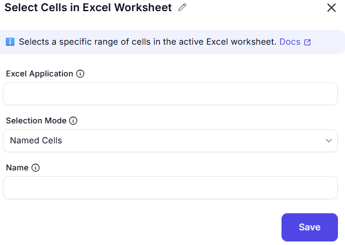

# Select Cells in Excel Worksheet

## Description
This dialog allows users to select a specific range of cells within an Excel worksheet. Users can define the start and end points of the selection, along with directional preferences for selection expansion.

## Fields and Options

### 1. Excel Application  
- A dropdown list where users select an active Excel instance.  
- Ensures that the action is performed on the correct workbook.  

### 2. Selection Mode
- A dropdown to specify the type of selection (e.g., single cell, range, entire row/column).  

### 3. Name
- The name of the named range to select (required if 'Selection Mode' is 'Named Cells').

## Use Cases  
- Selecting a specific range of cells for processing or data extraction.  
- Automating highlighting or formatting of specific cells.  
- Selecting data dynamically based on user-defined criteria.  

## Summary  
The **Select Cells in Excel Worksheet** dialog provides an interface for choosing a specific range of cells in an Excel worksheet. Users can define the starting and ending points, along with direction preferences, to automate cell selection efficiently.  