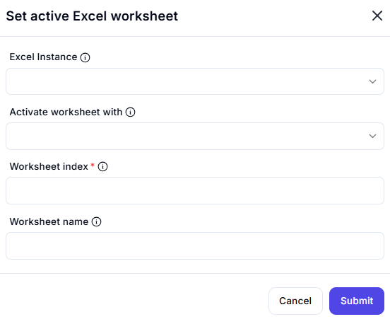

# Set Active Excel Worksheet  

## Description
This feature allows users to set a specific worksheet as the active sheet in an Excel workbook. It is useful for navigating between worksheets during automation workflows.  

  

## Fields and Options  

### 1. Excel Application 
- Select the Excel instance (workbook) where the worksheet will be activated.  
- This ensures the action is performed on the correct workbook.  

### 2. Selection Type 
- Choose how to identify the worksheet to activate:  
  - **Worksheet Index**: Use the index number of the worksheet (e.g., `1` for the first sheet).  
  - **Worksheet Name**: Use the name of the worksheet (e.g., `Sheet1`, `Data`).  

### 3. Search Value
- The worksheet name (if selection type is 'Name') or index (if selection type is 'Index').

## Use Cases

- Navigating to a specific worksheet during automation tasks.  
- Setting the active worksheet before performing operations like data entry or extraction.  
- Dynamically switching between worksheets based on workflow requirements.  

## Summary
   The **Set Active Excel Worksheet** action provides a way to set a specific worksheet as the active sheet in an Excel workbook. It ensures precise control over worksheet navigation, making it ideal for automation workflows involving multiple sheets.  