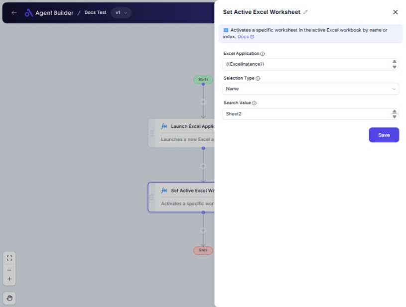

import { Callout, Steps } from "nextra/components";

# Set Active Excel Worksheet

The **Set Active Excel Worksheet** node allows you to designate a specific worksheet within an Excel workbook as the active sheet. This is useful for automating tasks such as data entry, computation, or report generation in a designated worksheet within a multi-sheet Excel file. By making a worksheet active, it ensures that subsequent Excel operations are applied to the correct sheet.

Examples of usage include:

- Ensuring data entries are made to the specified worksheet.
- Focusing Excel operations like formula calculation or data extraction on the correct worksheet.

## Configuration Options

| Field Name            | Description                                                                               | Input Type | Required? | Default Value |
| --------------------- | ----------------------------------------------------------------------------------------- | ---------- | --------- | ------------- |
| **Excel Application** | The Excel Application object containing the target workbook.                              | Text       | Yes       | _(empty)_     |
| **Selection Type**    | Choose whether to select the worksheet by Name or Index.                                  | Select     | Yes       | Name          |
| **Search Value**      | The worksheet name (if selection type is "Name") or index (if selection type is "Index"). | Text       | Yes       | _(empty)_     |

## Expected Output Format

This node doesn't produce a direct output, but it changes the active worksheet within the specified Excel Application object for subsequent operations.

## Step-by-Step Guide

<Steps>
### Step 1

Add **Set Active Excel Worksheet** node into your flow.

### Step 2

In the **Excel Application** field, provide the reference to your Excel workbook.

### Step 3

In the **Selection Type** dropdown, choose whether you wish to select the worksheet by "Name" or "Index".

### Step 4

In the **Search Value** field, enter either the worksheet name or the index number, depending on your selection in the previous step.

### Step 5

Ensuring the correct worksheet is active, proceed with other operations in your flow that need to interact with the spreadsheet.

</Steps>

<Callout type="info" title="Note">
  The worksheet index is 1-based, meaning the first worksheet is at position 1.
</Callout>

## Common Mistakes & Troubleshooting

| Problem                                       | Solution                                                                                      |
| --------------------------------------------- | --------------------------------------------------------------------------------------------- |
| **Invalid Excel Application object**          | Ensure the Excel Application field points to a valid workbook.                                |
| **Incorrect Search Value for Selection Type** | Double-check that the Search Value matches the Selection Type (either a valid name or index). |
| **Worksheet not found**                       | Confirm the worksheet exists in the Excel file and the name or index is correct.              |

## Real-World Use Cases

- **Data Import Processes**: Move data into a specific worksheet designed for incoming data.
- **Report Generation**: Apply formatting or compile data on a specific worksheet easier navigation.
- **Automated Calculations**: Focus calculations on a targeted worksheet for consistent results.
