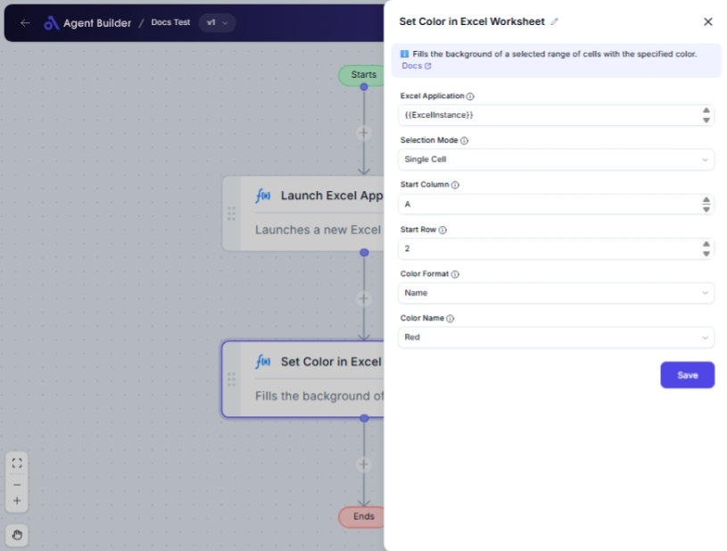

import { Callout, Steps } from "nextra/components";

# Set Color in Excel Worksheet

The **Set Color in Excel Worksheet** node is a handy tool to change the background color of cells within an Excel worksheet. It allows you to customize cell visuals based on various selection modes and color formats. This feature is especially useful when you want to visually organize data, highlight important information, or create a more readable Excel document.

## Configuration Options

| Field Name                  | Description                                                        | Input Type | Required? | Default Value |
| --------------------------- | ------------------------------------------------------------------ | ---------- | --------- | ------------- |
| **Excel Application**       | The Excel Application object containing the target worksheet.      | Text       | Yes       | _(empty)_     |
| **Selection Mode**          | Specifies how to select the cells to color.                        | Select     | Yes       | SingleCell    |
| **Start Column**            | The starting column of the cell/range to color (e.g., 'A').        | Text       | No        | _(empty)_     |
| **Start Row**               | The starting row of the cell/range to color (e.g., '1').           | Text       | No        | _(empty)_     |
| **End Column**              | The ending column of the range to color (e.g., 'B').               | Text       | No        | _(empty)_     |
| **End Row**                 | The ending row of the range to color (e.g., '10').                 | Text       | No        | _(empty)_     |
| **Named Range**             | The name of the named range to color.                              | Text       | No        | _(empty)_     |
| **Color Format**            | Specifies the format of the color input.                           | Select     | Yes       | Name          |
| **Color Name**              | The name of the color to apply (if using named colors).            | Select     | No        | _(empty)_     |
| **Color Hexadecimal Value** | The hexadecimal value of the color to apply (if using hex colors). | Text       | No        | _(empty)_     |

## Expected Output Format

This node does not produce a direct output value; instead, it modifies the appearance of the selected cells in the Excel worksheet by applying the specified background color.

## Step-by-Step Guide

<Steps>
### Step 1

Add the **Set Color in Excel Worksheet** node to your flow.

### Step 2

In the **Excel Application** field, specify the target Excel application object.

### Step 3

Choose a **Selection Mode** from the dropdown:

- **Single Cell**: Specify the **Start Column** and **Start Row** to color one cell.
- **Range of Cells**: Define a range with **Start Column**, **Start Row**, **End Column**, and **End Row**.
- **Named Cells**: Use a **Named Range** to select predefined named cells.

### Step 4

Select a **Color Format**:

- **Name**: Choose a predefined color name in the **Color Name** dropdown.
- **Hexadecimal Value**: Enter a hex color code in the **Color Hexadecimal Value** field (e.g., `#FF0000`).

### Step 5

Once you've configured the necessary options, the node will apply your selected color to the specified cells in the Excel worksheet.

</Steps>

<Callout type="info" title="Tip">
  Ensure that your Excel workbook allows editing and is not locked, to enable
  color changes.
</Callout>

## Common Mistakes & Troubleshooting

| Problem                             | Solution                                                                                     |
| ----------------------------------- | -------------------------------------------------------------------------------------------- |
| **Cells remain unchanged**          | Check if the Excel workbook is set to read-only or the worksheet is protected.               |
| **Color fields don't appear**       | Ensure the correct **Color Format** and **Selection Mode** are chosen for additional fields. |
| **Invalid cell or range specified** | Double-check the column letter(s) and row number(s) are correctly entered for the selection. |

## Real-World Use Cases

- **Data Visualization**: Use different colors to categorize data points in a dataset.
- **Priority Highlights**: Highlight urgent tasks or key figures with bright colors.
- **Error Marking**: Apply colors to cells that contain data needing review or correction.
- **Thematic Mapping**: Enhance presentation quality by color-coding data sections based on themes.
